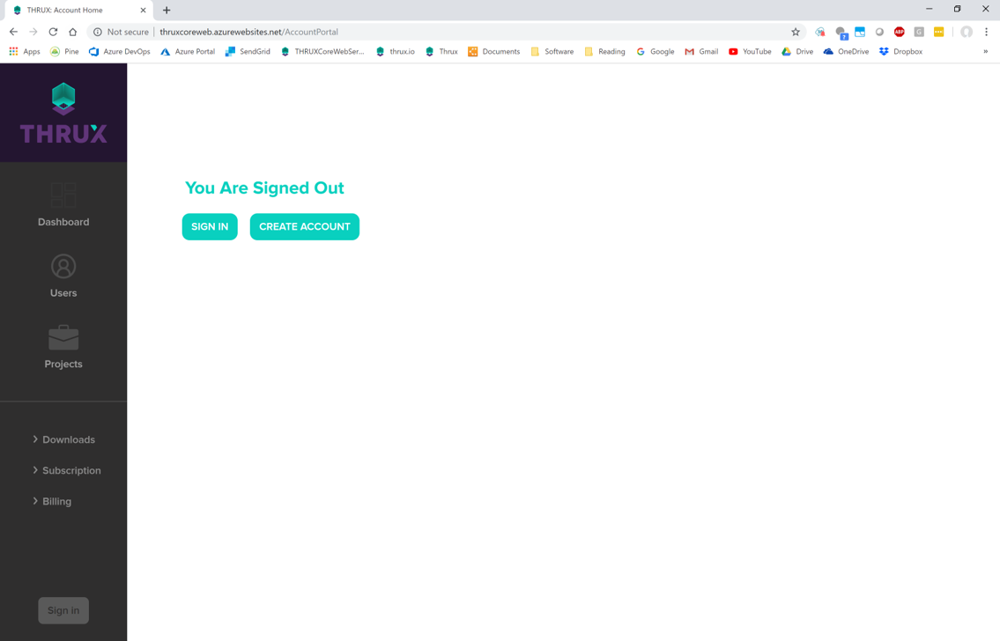

**Introduction**
================

In order to deliver the best possible design, or construct the best building, Owners and Architects explore multitudes of design options, while Engineers are tasked with ensuring that each design is safe and stable.  There is an increasing demand for professionals to rapidly respond to design changes while still preserving quality.

Engineering tools are scattered from paper to spreadsheets to analysis software to drafting tools and finally to the deliverable of printed drawings.  The lack of continuity between tools causes inefficiencies, which ultimately is paid by the Owner.

THRUX is a design environment aimed to unite engineering tools of the construction industry to provide consistent, transparent and flexible designs.

**What is THRUX?**
------------------

THRUX is a cloud-based design environment suite that fills the market gap of streamlined building design calculations, by bridging the gap between Engineers/Designers, Architects and Contractors, providing iterative, cost-conscious design assistance.

.. _New-User:

**New User?**
-------------

Check out the following resources to help you get started:

* Our :ref:`Product Overview <Product-Overview>` contains a high-level description of our services.
* We've created a :ref:`Tutorial Project <Tutorial-Project>` to quickly walk you through how to create a Project.
* Our :ref:`User Guide <User-Guide>` is a complete manual of all features.
* See our :ref:`FAQ <Frequently-Asked-Questions>` or our :ref:`Definitions <Definitions>` section for help.
* Check out our `Videos <https://www.thrux.io/videos>`_ page for a high level overview of our features, and our `Tutorial Videos <https://www.youtube.com/watch?v=c2Koj-hgpN8&list=PLw-PkBFPFGnsdR3FGFkuQJsamVq38IB2q>`_ to help you get started!
* Follow us on `LinkedIn <https://www.linkedin.com/company/thrux/?viewAsMember=true>`_, `Instagram <https://www.instagram.com/thrux.io/>`_, and `YouTube! <https://www.youtube.com/channel/UCkx1kvMvCRu6qVhzf3NJljQ/>`_

.. _Account-Portal:

**Setting Up Your Account, Installation, and Receiving Updates**
----------------------------------------------------------------

THRUX is a cloud-based application and automatically updates each time it is opened.

For installation, first visit the Account Portal and create an Account:

http://thruxcoreweb.azurewebsites.net/AccountPortal

    Account Portal

Then go to the Downloads page for the installation link.

**Accounts, Projects, Branches, and Subcriptions**
--------------------------------------------------

Projects are created by those who have an Account.  Accounts can be of a Basic, Professional, or Team subscription.  

###########
THRUX Basic
###########

  Basic accounts are able to create an unlimited number of Projects, and have access to the Help Center.

##################
THRUX Professional
##################

  Professional accounts include Basic functionality, but also provide the ability to interface with Revit, and access all MEP Trades.

##########
THRUX Team
##########

  Team subscriptions are geared towards organizations, and allow collaboration between Projects across multiple Teams.  

Once an Account creates a Project, they become the owner of that Project.  An owner has the ability to invite others to join a Project.

Whenever a Project is created, an initial Branch, or Issuance, is created.  Think of the Branch as the base scheme, and it cannot be reassigned.

You can create Branches, or Issuances, off of the base scheme, and can then use analysis tools to compare Branches against the base Branch.

**Storage and Recovery Options**
---------------------------------

THRUX models are stored in the cloud and are periodically backed up.  

THRUX utilizes Microsoft Azure Storage to store and replicate models in a highly available, secure, scalable, and geo-redundant manner.  Microsoft handles maintenance for their Azure storage facilities which are encrypted and accessible from anywhere in the world.  You have the ability to revert your Projects to a specific point in time.

For more information, click :ref:`here <Recovery-Options>`.

.. _Support:

**Contact Us/Support**
-----------------------

If you would like to request a demonstration or for further technical assistance, contact us at:

* thruxservices@thrux.io 
* 212-547-9802

Also, visit our website at: https://www.thrux.io and get in touch with our support team.