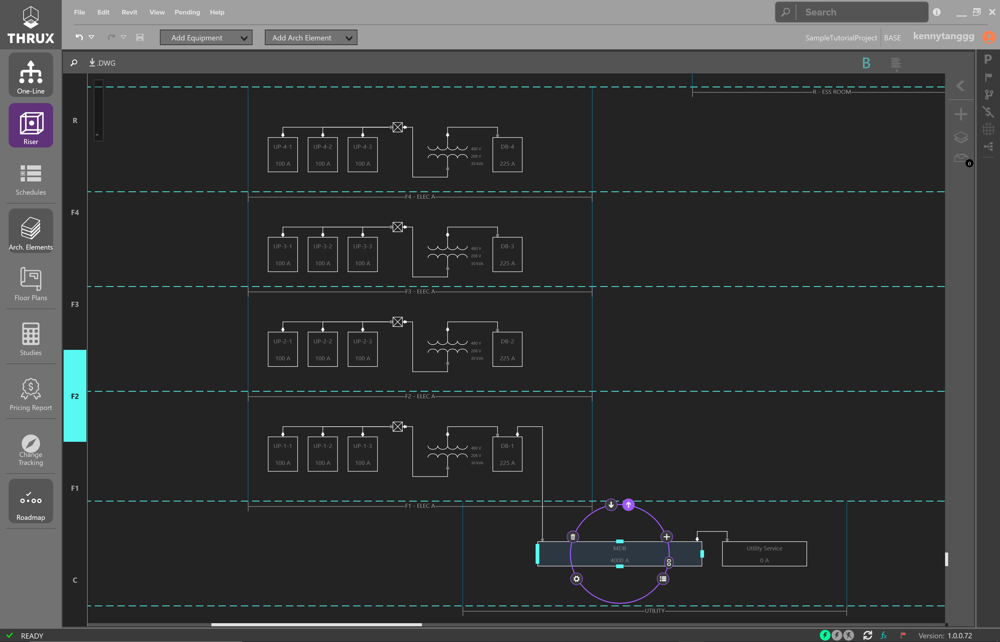
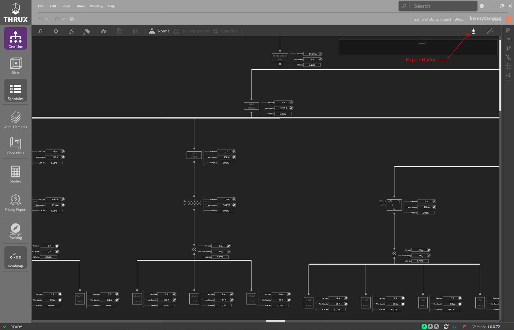
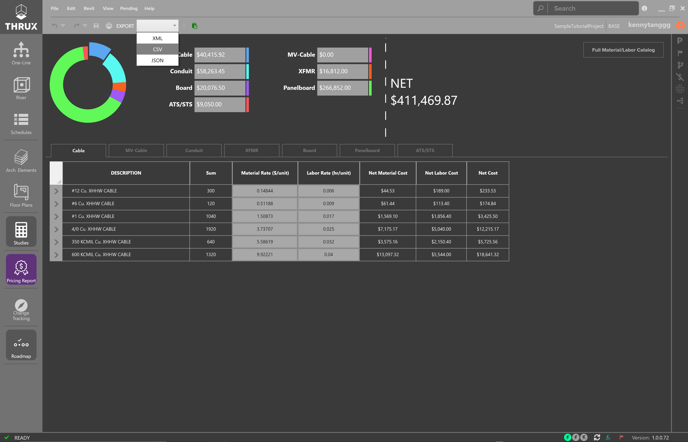

.. _Tutorial-Project:

**Creating a New Project**
============================

Sign in with your Account and click on the New Project button (+ sign).

.. figure:: images/NewProject.PNG
    :align: center

    Homescreen

Give your project a name, and click the Start button in the bottom right.

    New Project - Default Settings

First Steps
-----------

A common question is: Where do I start?

Depending on the information you have, it may be better to start in one area than another.

What do you know about the physical shape of the project?  Do you know where your MER rooms are located?  Are these locations highly subject to change?

Is it a tall building or vertically scaling?  Is it a wider and longer scope with a few floors?

For a base building project, create the Architectural model.  It aids with automating equipment distances, and is also necessary to set up the :ref:`Riser <Riser>`.

Further analysis can be done using the :ref:`One-Line <One-Line>` or the :ref:`Schedules <Schedules>`

Otherwise, it is best to start in the :ref:`Riser <Riser>`.

.. _Roadmap:

##############
Roadmap
##############

To help guide the design process, refer to the Roadmap.  Clicking on each node will bring you to that process.

.. figure:: images/Roadmap.PNG
    :align: center

    Roadmap

**Creating the Architectural Model**
====================================

In this sample project, we're going to create a building with a 100 ft. by 100 ft. footprint, has 5 floors, and stands 50 ft. tall. 

The purpose of developing the Architectural Model is to automate the calculation of Equipment distances.  

Distances between Equipment are determined by the orthogonal route of their respective Room locations.

It is often necessary to route conduits through a Riser.

Click :ref:`here <Define_Architecture>` for more information on the Architectural Model.

Creating Columns and Floors
---------------------------

Open the :ref:`Floor Plans <Floor-Plans>` and use the Setup Wizard to create Columns and Floors.

Click on Create Columns (X) and a wizard will prompt asking for a Prefix, Quantity, Offset, and Starting Dimension.

Create 11 columns, prefixed with the name “X”, with an offset of ten (10), and a starting dimension of zero (0).

    Creating X Columns

Click on Create Columns (Y) and repeat this process for the "Y" Columns.

Then Click on Create Floors, and create 5 Floors which are spaced 10 feet apart.

If you have a general idea for your MER spaces and riser shaft locations, enable Creation Mode and create Rooms.

If you don't, skip these steps and move straight to the next section :ref:`Modeling the Electrical System <Modeling-Electrical-System>`.

Creating Rooms
----------------

    Create a Room by Hovering Over a Column Section

Give the Room a Name.

Assigning a Space Type and area are optional and used for loading calculations.

Creating Stacked Rooms or a Riser
----------------------------------

Use Shift + Click to select multiple Floors.

Then hover over a region to create Stacked Rooms or a Riser.

.. figure:: images/FloorPlans-multi_room-riser.PNG
    :align: center

    Creating a stacked Room or a Riser while multiple Floors are selected

The Riser displays as a hatched region.

    
    Creating a Riser

.. _Modeling-Electrical-System:

**Modeling the Electrical System**
==================================

Riser
-------------

Once you have a base architectural model set up, click on :ref:`Riser <Riser>` to open the Riser Workspace.

Floors are plotted automatically based on their elevation.  

However, Rooms and Equipment are not automatically plotted and can be created outside of this Riser Workspace.

Instead, they are placed in an unplotted elements section and must be manually added to the Riser.

    Blank Riser Diagram

Drag elements from the unplotted Elements section onto the Riser.

Once an Equipment is dragged into a Room region, the location of the Equipment becomes associated with that Room.

#############
Placing Rooms
#############

Begin by placing your equipment Rooms on the Riser.  Once an Equipment is placed in a Room region, its location becomes associated with the Room.

An Equipment does not need a Room location and there may be instances where an Equipment is not associated with a Room.

    Sample Riser Diagram without Equipment

Once your Rooms are laid out, begin to model your Equipment.

###################
Creating a Source
###################

Start with a source, or a Utility Equipment.  

Click on Add Equipment, and click and drag a Utility onto the Riser.

#####################
Creating Connections
#####################

Select the Utility and then use the arrows pointing outwards to start creating outbound connections.  

Draw connections using the left-click button.  

    Creating an Outbound Connections

Then use Enter to create an Equipment.

.. figure:: images/Riser-Connections-2.PNG 
    :align: center
    
    Feeding a Distribution Equipment

Create the arrangement shown below:

    A Distribution Board, Feeding a Step-Down Transformer, a Tap Node, and Panelboards

###############################
Copying and Pasting Equipment
###############################

To Copy and Paste Equipment, select a group of equipment by dragging a selection box around them.

The selected Equipment will be highlighted.

.. figure:: images/Riser-Connections-5.PNG
    :align: center

    A Group of Selected Equipment

Then use CTRL+C to copy.

Use CTRL+V to paste.

.. figure:: images/Riser-Connections-6.PNG
    :align: center

    A Group of Selected Equipment

Feed the equipment by creating outbound connections from the source (MDB).

Alternatively, use the arrows pointing inwards to create a connection which feeds the selected Equipment.

    Creating Outbound Connections

Draw connections from the source to the load.

    Drawing Connections Between Equipment

###################################
Moving Equipment, Floors, or Rooms
###################################

To move equipment, floors, or rooms, first select a group of equipment by using a selection box.  Then drag and drop the entities to the new location.  

It is important to note that the elevations of the floors are disconnected from their visual representation.  Shifting a floor does not change its elevation.

    Moving Equipment, Floors, and Rooms

###############################
Creating Transfer Switches
###############################

Create a transfer switch by modeling an ATS/STS.

Create the emergency source Equipment and emergency Panelboards shown below:

    Creating Emergency Equipment

Massage the layout of the Riser as needed.

    Example of Finished Riser Diagram

For further analysis of your system, use the One-Line.

One-Line
--------

The One-Line is a top-down view of your electrical system.  Power starts at a source and flows down to branch loads.  Refer to the :ref:`One-Line <One-Line>` in the :ref:`User Guide <User-Guide>` for more information.

The One-Line is generally used for analyzing your system from a power flow perspective, as opposed to the Riser's construction and location perspective.

    
    Sample One-Line

The One-Line contains various tools to analyze and modify your system.

    
    Sample of the One-Line with the Load Flow view toggled on

Schedules
----------

The Schedules are a tabular representation of your distribution system.  It's a much more rapid environment to create equipment.  

It does not diagrammatically represent the locations of Equipment as well as a Riser diagram.

    Sample of Schedules Workspace

Refer to the :ref:`Schedules <Schedules>` for more information.

**Exporting, Studies, and Reporting**
=====================================

Exporting to AutoCAD
--------------------

The :ref:`Electrical Workspaces <Electrical-Workspaces>`: :ref:`One-Line <One-Line>`, :ref:`Riser <Riser>`, and :ref:`Schedules <Schedules>` are all exportable to AutoCAD.

Use the Export button (down arrow) and use Export to AutoCAD..

    Exporting the One-Line

    Exporting the Riser

    Exporting the Schedules

The Studies are a reporting view of your design.  Reports like Voltage Drop, Loading, and Short Circuit are available.

    Studies are printable and exportable to Excel

Studies and Reporting
---------------------

The :ref:`Studies <Studies>` and :ref:`Pricing Report <Pricing-Report>` are reporting mechanisms for engineering studies and pricing.

Both Workspaces are exportable to Excel.

.. figure:: images/Studies-Export.PNG
    :align: center

    Exporting the Studies to Excel

    Exporting the Pricing Report to Excel

For a complete guide of all features, please refer to the :ref:`User Guide <User-Guide>`.
