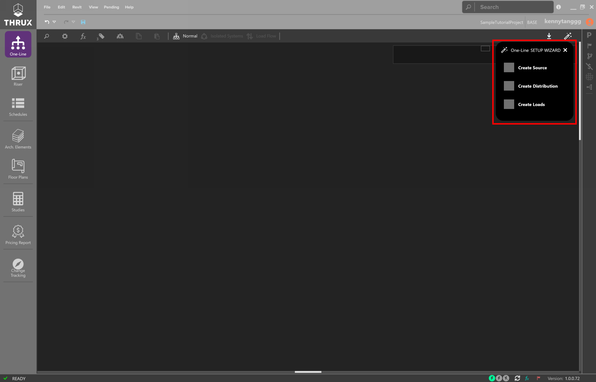
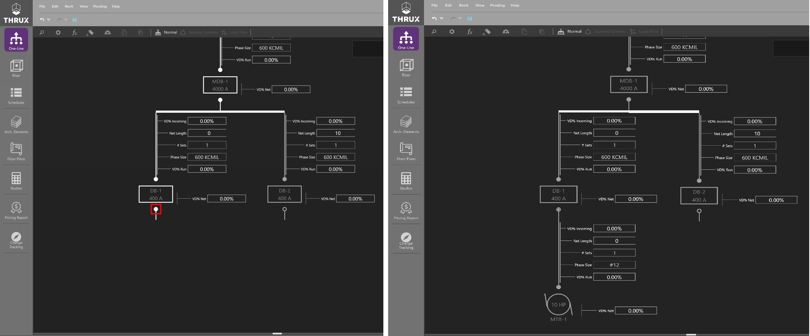
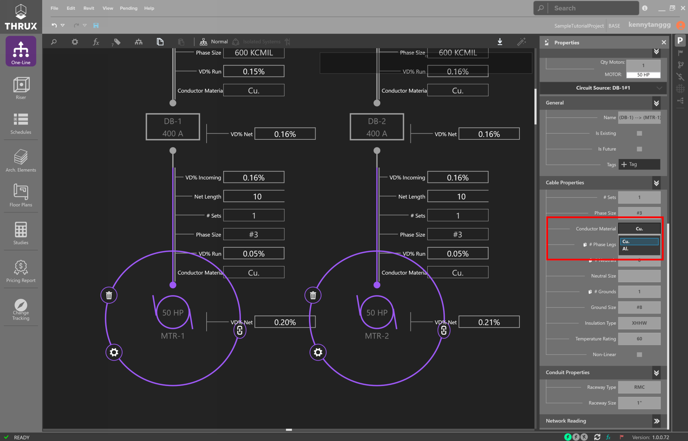
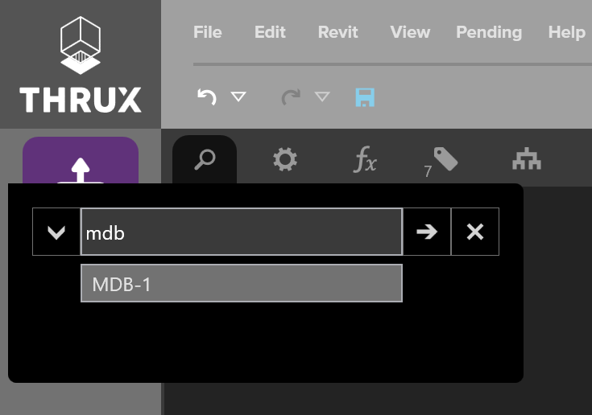
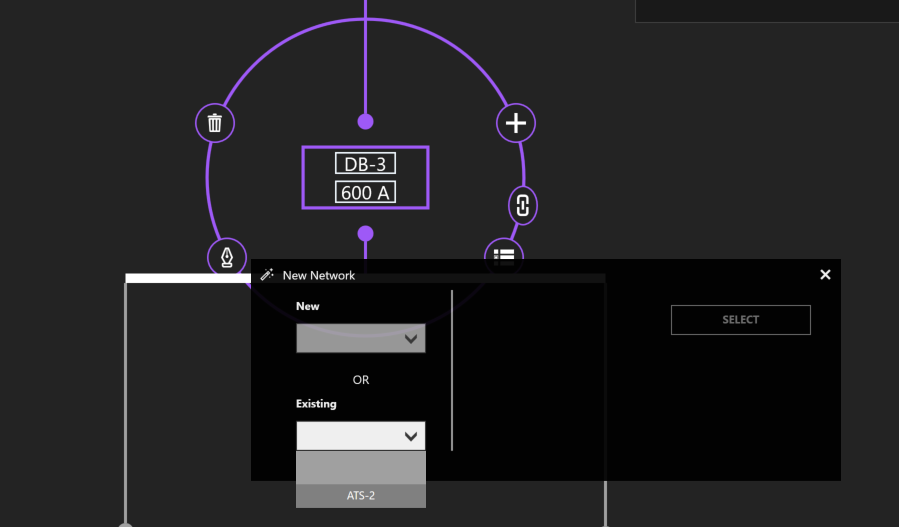
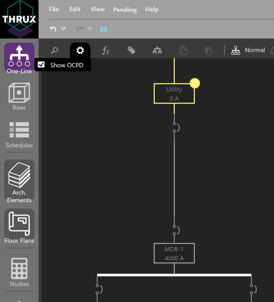
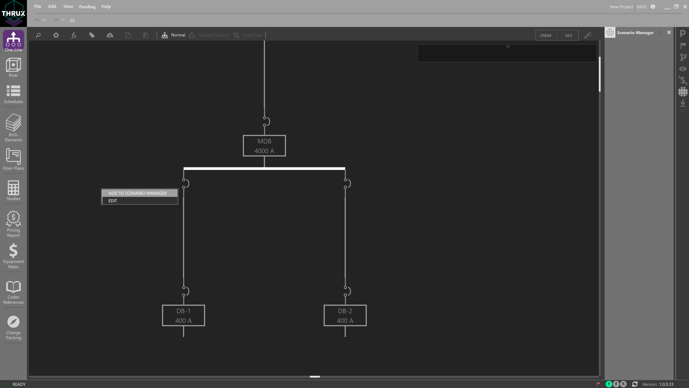
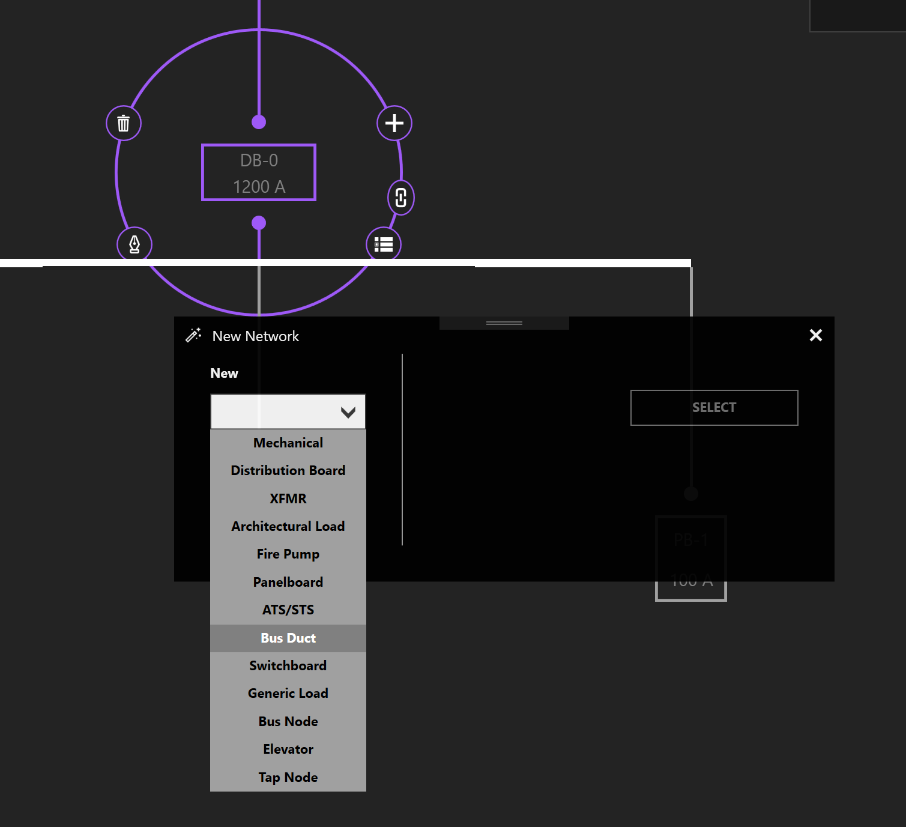

.. _One-Line:

The :ref:`One-Line <One-Line>` represents power flow of the distribution system shown from top to bottom, and generally consists of Sources, Distribution Equipment, and Loads.  Types of sources include a Utility or a Generator.  

Using the :ref:`Workspace Toolbar <Workspace-Toolbar>` on the left, click the One-Line icon to open the Workspace.  

.. index:: How to Create a Source

.. _One-Line-Adding_A_Source:

Add a Source
============

Use the Setup Wizard in the top right and select Create a Source.

Sources specify the level of short circuit current (SCC) that is potentially available in faulted systems.  Short circuit current contributions could stem from the generator's sub-transient reactance or the utility takeoff secondary terminals.

    Using the Setup Wizard

Using the New Network wizard, create a Utility Equipment.

When using the New Network wizard, only the minimum pieces of information are required to create a piece of Equipment.  This information will vary from Equipment to Equipment.  For example, when creating a transformer the secondary voltage must be specified, but for a mechanical load only the size of the motor is required.  More detailed properties can be specified and modified later.

Or right-click inside the Workspace, click Add Source, then click Utility Source.  

Note that the ability to add Unhosted Equipment is available.  

.. _One-Line-SCC:

Short Circuit Current
----------------------

Select the Utility source.  Under the "Miscellaneous" property grouping, enter the value under Available SCC (kA).

    Entering Available SCC (kA)

.. _One-Line-Adding_Equipment:

Add Equipment
=============

Click on the Utility and the Selection Dial will display a ring of options.  Selected Equipment will be highlighted by a purple circle, with additional options to Add, Copy, Paste, Delete, and Navigate to other Workspaces.  Click the + button to Add Equipment.

    Selection Dial

Select an Equipment type from the dropdown menu.  Give the Equipment a name.  In this case, specify a :ref:`Load Capacity <Load-Capacity>`, and click Select.

    New Network Wizard

.. index:: How to Copy Equipment - One-Line

.. _One-Line-Copying_Equipment:

Copy/Paste Equipment
======================

To copy Equipment, select the Equipment.  Then, click Copy or use CTRL+C to copy.  The selection will highlight pink and be added to the clipboard.  

Then select the Equipment you want to create a pasted copy of, and click Paste or use CTRL+V.

    Copying an Equipment will copy its entire downstream network

Delete Equipment/Delete Network
=================================

To delete Equipment, select the Equipment.  Then Click Delete (trash symbol) or use DEL to delete. 

If the selected Equipment is feeding downstream Equipment, you have the option to either delete the selected Equipment or the entire network.  Deleting Selected Equipment will only delete what is selected and any downstream equipment or children of the Selected Equipment will be disconnected and considered Unhosted.

    Deleting the selected Equipment or Entire Network

.. _One-Line-Rehosting:

Dragging/Rehosting Equipment
==============================

To redirect an Equipment's source, click and drag the Equipment from its current source to a different source.

    Rehosting MTR-2 to DB-1

Navigate
========

Navigate grants the ability to jump between Workspaces based on the current selection.

Some examples of navigation include viewing an Equipment's :ref:`Schedule <Schedules>`, location on the :ref:`Riser <Riser>`, location on the :ref:`Floor Plans <Floor-Plans>`, or the :ref:`Studies <Studies>` Workspace.

    Using the Selection Dial to navigate to other Workspaces

Expanding/Collapsing Equipment
==============================

Sections of the distribution network can be expanded or collapsed on a group basis by using Expand All/Collapse All.  

    Using Expand All/Collapse All to visually maneuver the distribution network

Another way is by clicking on a distribution node, or double-clicking on the Equipment itself.

    Clicking on a distribution node individually expands or collapses the network

    A distribution node fills when it is fully expanded

Changing Multiple Equipment Properties
======================================

It is possible to change a property which is common across multiple elements.  

First, drag a box to select multiple elements, or use CTRL+Click to select each element.

    Selecting multiple motors by dragging and dropping a selection box

Then change a property such as Conductor Material from copper to aluminum.

    Using the Properties Explorer to change the Conductor Material

Note that since Design Assistance is on, the circuit's code-minimum values are recalculated.

    Viewing circuit properties as a result of changing the conductor material

.. _One-Line-Reset-to-Code-Minimum:

Reset to Code Minimum
=====================

It is possible to manually modify circuit elements which cause a violation of safety codes and standards.  

To recalculate or reset the values of a circuit to code-minimum values, right-click on an Equipment and use Reset to Code Minimum.

    Using Reset to Code Minimum

Workspace Toolbox
=================

Utility functions like searching, additional viewing properties, or calculation settings can be found on the Workspace Toolbox on the top toolbar.  

    One-Line Workspace Toolbox

Searching
---------

To search for Equipment, click the magnifying glass in the top left.  Start to type the name of an Equipment.  A dropdown will appear with any Equipment matching the specified name.  Select the Equipment, and the Workspace will navigate to the associated Equipment.

    Searching for Equipment

.. _One-Line-Load-Calculations:

Load Calculations
-----------------

*   **Normal:** Calculations are based on the :ref:`Net Load <Net-Load>`.
*   **Board Capacity - 80%** Calculations are based on 80% of the board's :ref:`Load Capacity <Load-Capacity>`.
*   **Board Capacity - 60%** Calculations are based on 60% of the board's :ref:`Load Capacity <Load-Capacity>`.

.. _Property-Tags:

Property Tags/Quick Views
-------------------------

Property Tags can be applied to assist with design or network visualization.  They provide flexibility with viewing specific properties of the model.

Click the tag symbol in the upper left of the Workspace Toolbox.  

Quick Views are preset property groupings such as Voltage Drop, Loading, Load Diversification, and Circuit Routing. 

    Selecting the Voltage Drop Quick View

The number is an indicator of how many Property Tags are being displayed.

Use the Clear All button to clear the display of Property Tags.

^^^^^^^^^^^^^^^^^^^^^^^^
Assigning Room Locations
^^^^^^^^^^^^^^^^^^^^^^^^

The distance between two pieces of Equipment are determined by their Room location via an orthogonal route.  Open the Property Tags, and select Room.  

    Using Property Tags to assign a Room

Assign a Room by clicking in the text box.  If no Rooms are available, create them using the :ref:`Architectural Workspaces <Architectural-Workspaces>`.

    Using Property Tags to assign a Room

For the Distribution Board, MDB-1, note the :ref:`Calc. Length <Calculated-Length>` before and after a Room location is assigned.

.. figure:: images/one-line-assigning-room--3.PNG
    :align: center

    Select a Room by clicking in the text box

^^^^^^^^^^^^^^^^^^^^^^^^^^^^^^
Routing Through a Riser Shaft
^^^^^^^^^^^^^^^^^^^^^^^^^^^^^^

To route through the Riser, add a Property Tag for Riser under Network Properties.

    Routing Through a Riser

Assign a Riser and note the updated length.

    Routing Through a Riser

One-Line View Selectors
-----------------------

Different Views such as Isolated Systems and Load Flow can be applied to aid the designer.  

By default, Normal is selected.  

^^^^^^^^^^
Load Flow
^^^^^^^^^^

Load Flow is recommended when studying how a system is loaded. 

.. figure:: images/one-line-load_flow.PNG
    :align: center

    Using Load Flow view to diagnose loading concerns of the network.

^^^^^^^^^^^^^^^^
Isolated Systems
^^^^^^^^^^^^^^^^

Isolated Systems is recommended when viewing complex, redundantally distributed systems. 

    Using Isolated Systems to study loading as a result of different sources

Click on the arrow buttons to jump to the section of the distribution network.

    Navigating to a different section of the network

.. _One-Line-Transfer_Switch:

Creating a Transfer Switch
==========================

Transfer switches are connected to a primary and secondary source of power.  To create a transfer switch, click Add Equipment and choose ATS/STS.

.. figure:: images/one-line-transfer_switch-1.PNG
    :align: center

    Using Selection Dial to Add Equipment

    Creating a transfer switch

To connect the secondary source of power, choose another distribution Equipment.  

Then click Add Equipment and select an ATS/STS from the Existing dropdown menu.

    Connecting to an existing transfer switch

Settings
========

Toggle the visibility settings of OCPD's by clicking on Show OCPD.

    Showing OCPDs on the One-Line

Open an OCPD by clicking on the OCPD.

    An open breaker denotes an open circuit

.. index:: How do I model a load shedding sequence?
.. index:: How do I use the Scenario Manager?
.. _Scenario-Manager:

Scenario Manager
----------------

The Scenario Manager can be used to model different scenarios representing the state of protective devices.  It is generally used in conjunction with the One-Line.

For example, a designer may want to perform a load flow study of their electrical system as certain protective devices are opened or closed.

Open the Scenario Manager and show the OCPD's on the One-Line.

Right-click on a protective device to add it to a Scenario.

    Adding a protective device to the Scenario Manager

In each Scenario, toggle the different states of protective devices, and also toggle between different Scenarios as shown below.  Note that the color of live Equipment changes when a protective device is opened or closed.

.. figure:: images/one-line-scenario_manager-2.PNG
    :align: center

    Scenario 1 with Sub-Scenario 1 Active

.. figure:: images/one-line-scenario_manager-3.PNG
    :align: center

    Scenario 1 with Sub-Scenario 2 Active

.. _One-Line-Bus_Duct:

Bus Duct
========

Select an Equipment.  Then select Add Equipment to create a Bus Duct.  

    
    Using the New Network Wizard to create a Bus Duct

Visually, the representation of a Bus Duct is misleading and will be changed in an upcoming update.  See :ref:`here <Bus-Duct-Calculations>` for a reference to how loading and voltage drop calculations apply to a Bus Duct.

    A Bus Duct with Panelboards as branch loads