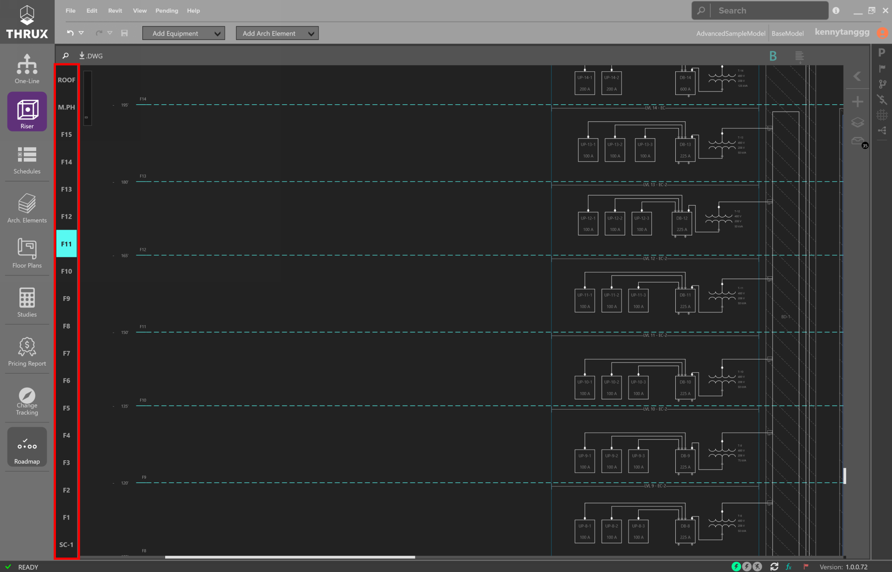
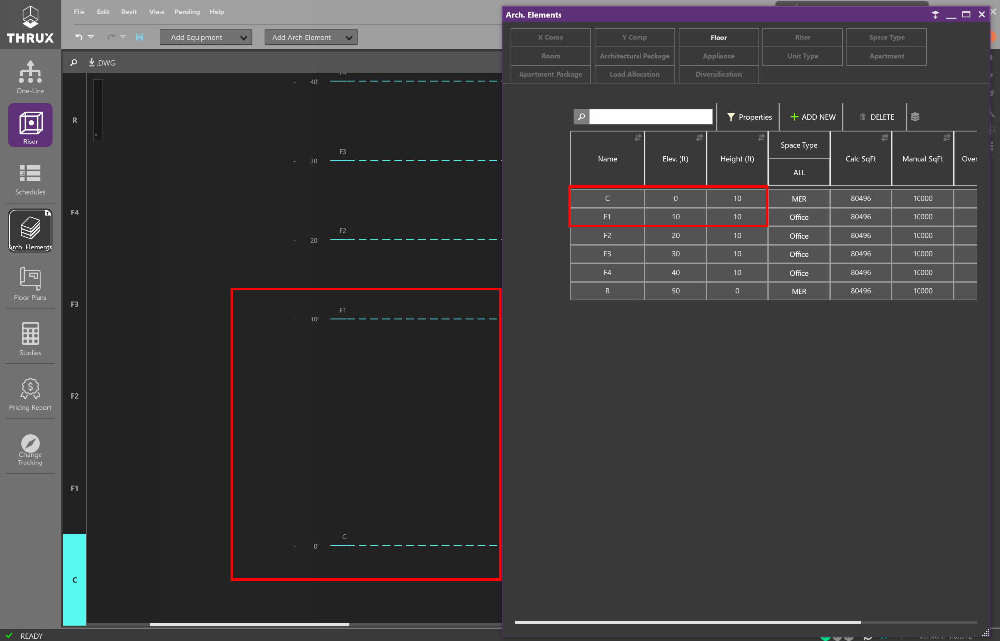
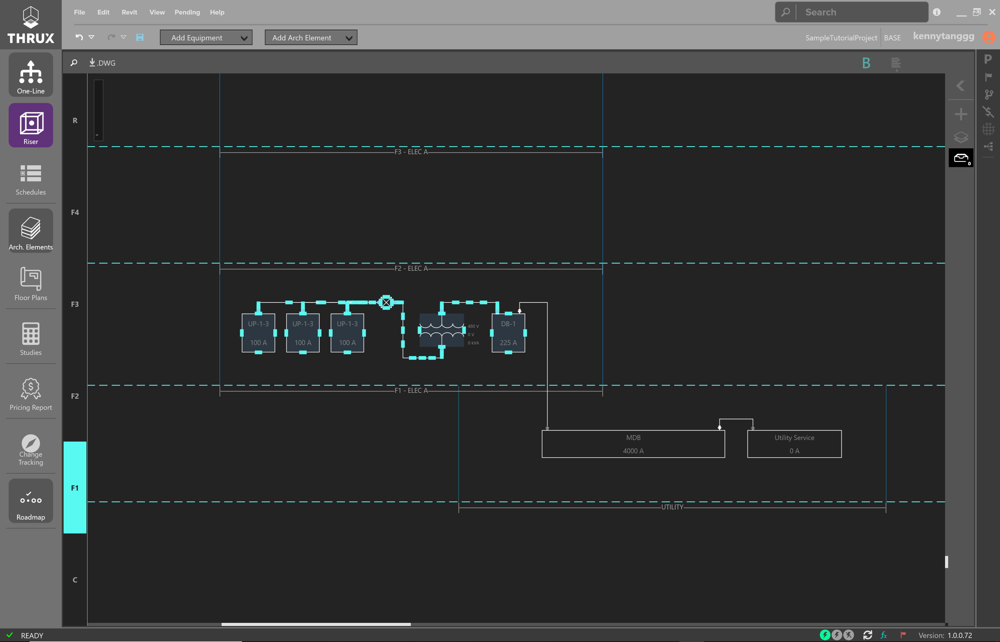
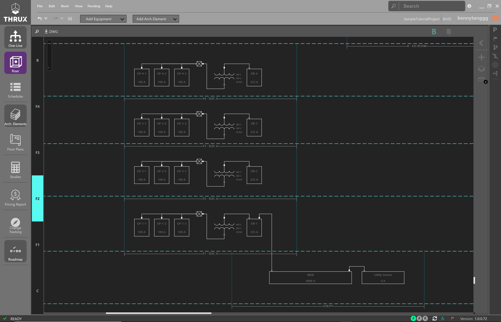
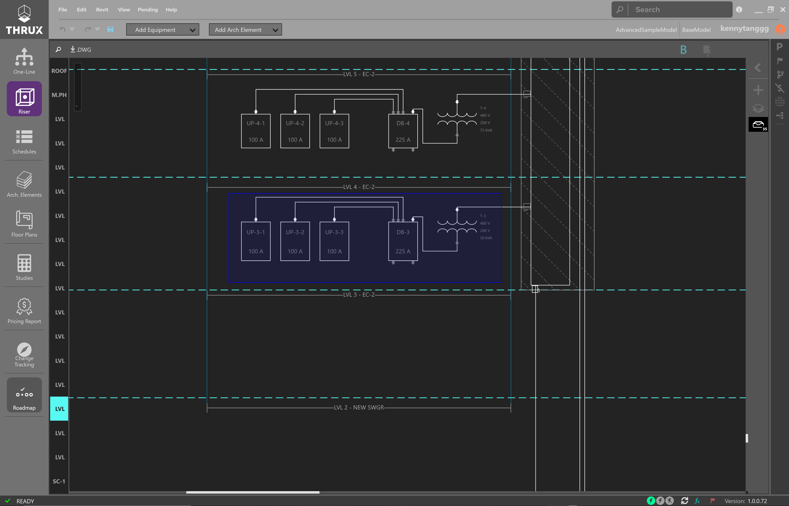
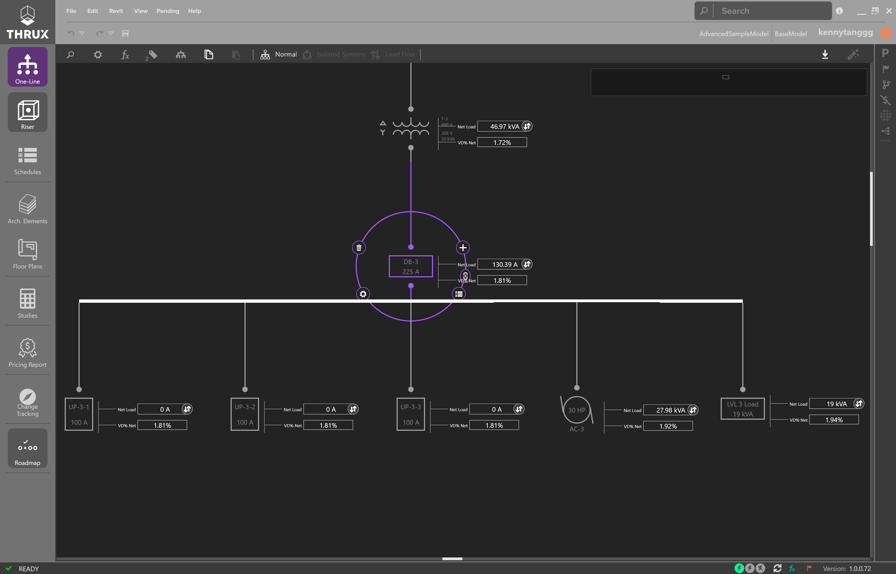
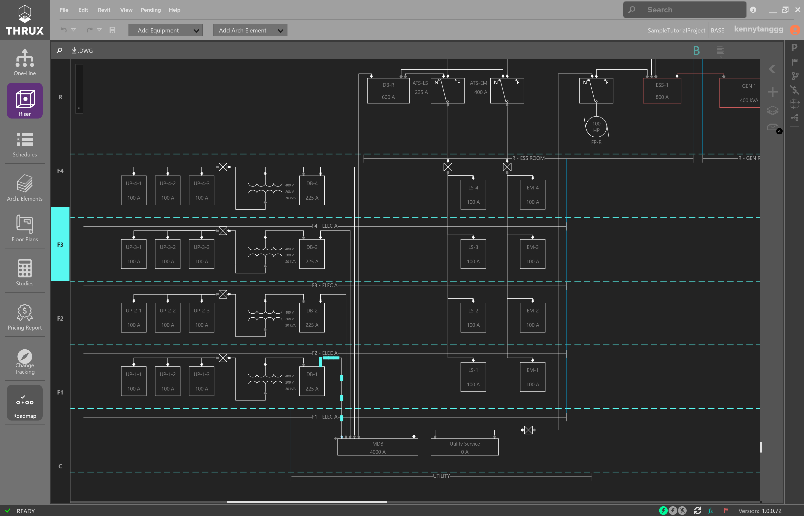
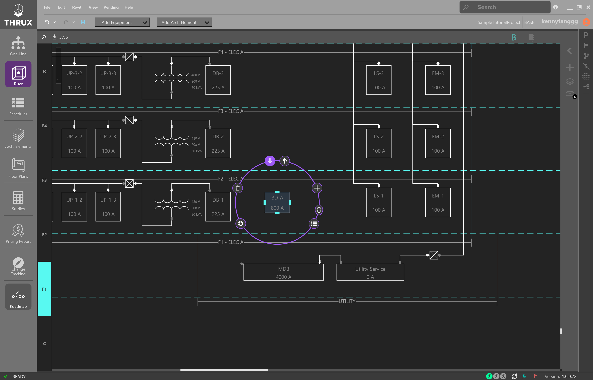
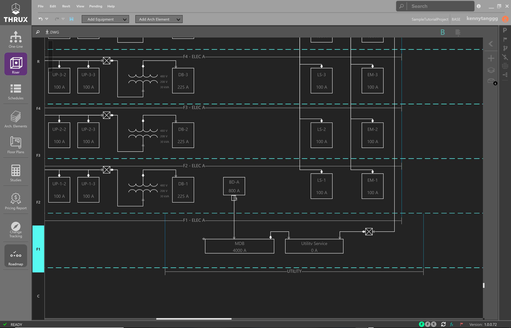
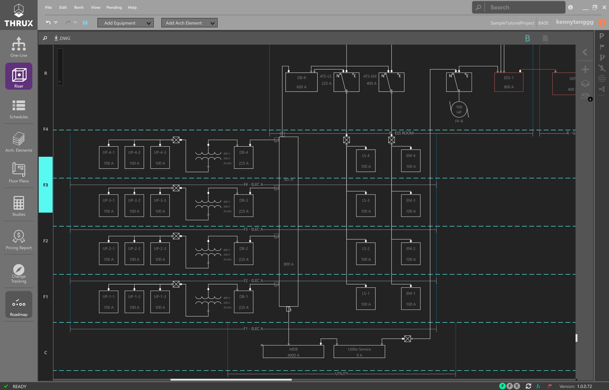

.. _Riser:

The Riser Workspace is an elevational representation of the distribution system.  It is used to depict wiring routes as they disperse through a vertically scaling project.

    Example Riser Diagram

Note that the interactions between the Riser, :ref:`One-Line <One-Line>`, and :ref:`Schedules <Schedules>` are similar.

    Selection Dial

Navigation Overview
===================

Floor Navigator
---------------

On the left, is a Floor navigator.  It will highlight and navigate to the selected Floor.  

    Cycle through Floors using the Floor Navigator

Floors are denoted by the dashed regions, while Rooms are denoted by the solid regions.

    Floors vs. Rooms

.. _Riser-Floor-Elevations:

^^^^^^^^^^^^^^^^^^^
Floor Elevations
^^^^^^^^^^^^^^^^^^^

In the Riser, the elevations of each Floor are annotations which are not connected to the visual spacing or distance between floors.

In other words, moving the Floor will not change the elevation of the Floor.

    Viewing the Floor Elevation in the Riser and the Arch. Elements

Moving the Floor will not affect the elevation.

    Changing the visual spacing between Floors

Changing the Floor annotation will affect the lengths of feeders and voltage drop calculations.  

    The Riser Floor annotations are linked to the :ref:`Arch. Elements <Arch.-Elements>`

.. _Riser-Toolbox:

Riser Toolbox
-------------

On the right is the Riser Toolbox, which allows you to search for Equipment, control layers of the circuits between Equipment, and view :ref:`Hidden Elements <Hidden-Elements>`.

    Riser Toolbox

Click on the Filters button (layers icon) to open the Layers filter.

    Filters allow greater flexibility with visibility

Right-click on a connection to change the layer of an Equipment and note the display.

    Identifying a circuit as existing

.. _Hidden-Elements:

^^^^^^^^^^^^^^^^^
Hidden Elements
^^^^^^^^^^^^^^^^^

Hidden Elements are Architectural Entities or Equipment which are not being shown on the Riser.  To display them, simply click on these elements or click and drag them onto the Riser.

Not every element in the model needs to be shown on the Riser.  To hide an element, use right-click and Hide.

    Filtering the Hidden Elements by using the search bar

It's possible to draw circuits which are hidden from the Riser.  Hover over the arrow to see which element is hidden.

    Hover over the arrow to view hidden elements or to begin drawing their connection.

Click and drag the arrow to draw the new connection.

    Drawing Hidden Elements

.. _Riser-Toolbox-Arch-Elements:

Add Architectural Elements
==========================

To add Floors, Rooms, Architectural Elements, or electrical Equipment, use the toolbox at the top.

    Adding Elements

Drag and drop elements from the toolbox to the Workspace to place elements.

    Adding Architectural Elements 

Add Electrical Equipment
========================

To place Equipment, drag and drop elements from the toolbox into the Workspace.

.. figure:: images/riser-arch_toolbox_add_equip-1.PNG
    :align: center

    Adding Electrical Equipment 

To place an Equipment in a Room, drag the Equipment into the Room region.

    Equipment placed in a Room

Connecting Equipment
====================

There are three different types of connections between Equipment: Outbound, Tie, and Infed.  These are also known as Load, Tie, and Source, respectively.

To create a connection between Equipment, select the Equipment.  Then choose the type of connection.  An outbound arrow will create an Outbound connection, indicating you are drawing a connection to a load.  An inward facing arrow will create an Infed connection, indicating that you are drawing a connection to a source.

    Using the Selection Dial to create connections

Draw out the connection using the mouse and use Enter to create an Equipment.  

    Use Enter to place Equipment

Resetting Connections
----------------------

To quickly redraw a connection between equipment, use the reset command.  Right-click on the circuit.  Then choose Reset.

Copying Equipment
=================

Select the Equipment and use CTRL+C to copy.

    Copying multiple pieces of Equipment

Use CTRL+V to paste.

    Pasting multiple pieces of Equipment

Moving Equipment
================

It is possible to move Equipment by an individual or a group basis.

Select a single Equipment or select multiple by using CTRL+Click, or drag and drop a selection box.

    Selecting multiple pieces of Equipment

Then click and drag to move Equipment.

Resizing Equipment
===================

To resize equipment, select on a piece of equipment.  Use the grips to change the size.

    Resizing an Equipment

Navigate
==========

Similarly to the :ref:`One-Line <One-Line>` and the :ref:`Schedules <Schedules>`, it is possible to jump between Workspaces.

A piece of Equipment may be found on multiple Workspaces.

Selecting an Equipment and using the Navigate button to jump to another Workspace.

    Using the Navigate button

Choose the Workspace to jump to.

.. figure:: images/Riser-Navigate-2.PNG
    :align: center

    An Equipment can be Found on Multiple Workspaces

Navigating to the One-Line will expand the network and select the node.

    Navigating to the One-Line

Converting to Bus Duct
======================

To convert pipe and wire connections to a bus duct, first delete the existing circuits on the Riser.  

Select a circuit and use the delete (Del) key.

    Deleting Existing Circuits

Delete all of the existing circuits which will be fed from the Bus Duct.

.. figure:: images/Riser-ConvertToBusDuct-2.PNG
    :align: center

    Deleting the Existing Circuits

Create a Bus Duct by dragging and dropping it onto the Riser.  

    Creating a Bus Duct

Then feed it from MDB by creating an Inbound connection.

Create an Inbound connection by clicking the arrow facing inwards.

    Creating a Bus Duct

Draw the connection to the source.

    Connecting a Bus Duct to a Source

Select your Bus Duct, resize it, and use the Outbound arrow to draw connections to your loads.

    Connecting to Existing Equipment

Draw the remaining electrical connections.

    Connecting to Existing Equipment