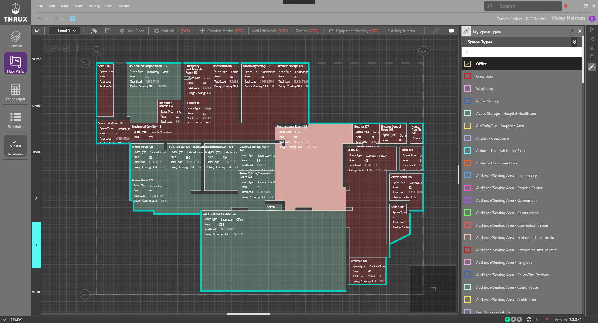
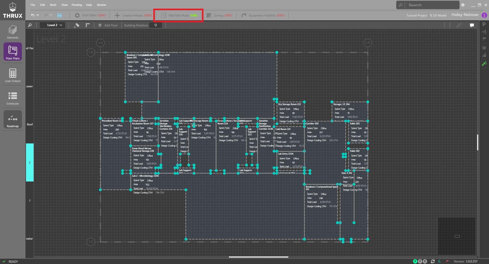
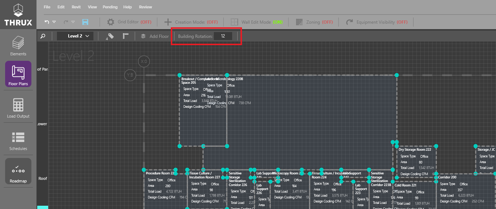

.. _The-Mechanical-Floor-Plans:

##########################
Working in the Floor Plans
##########################

The mechanical floor plans provide a visual interface for load calculations. Here, the basis of design templates created in the :ref:`Elements Workspace <Mechanical_Elements>` can be associated with the spaces, walls, windows, and roofs in the building.

Assigning Space Types to Spaces
-------------------------------

Double click a space, and the :ref:`Properties Explorer <Properties-Explorer>` will open, displaying information about the selected space. Space types can be assigned one by one using this explorer or, they can be quickly assigned with the Quick Tag tool, shown below. 

    Select a space type from the Quick Tag Explorer and click spaces in the floor plans to assign them to the selected template. 

Wall Edit Mode
--------------

While THRUX understands the length, height and direction of every wall in the model, defining a wall as exterior vs. interior us left up to the user. Toggle on "Wall Edit Mode" at the top of workspace to edit the walls of the building.

With Wall Edit Mode enabled, the edges of each space become selectable. To batch select, draw a selection region enclosing one or more of the highlighted edges. Dragging to the left selects every edge touched. Dragging to the right selects only the edges fully enclosed by the region. By default, selected egdes are indicated as exterior and therefore contribute to the load of the space. 

Exterior walls are indicated visually in the plans with highlighted teal. Interior "load contributing" walls are indicated with a soft tan. Note, interior walls separating conditioned spaces are NOT required to be identified and should be left unselected. Only interior walls that separate spaces of differing interior temperature setpoints are required to be indicated as interior.

.. csv-table:: Wall Properties
    :file: images/WallProperties.csv
    :widths: 30, 70
    :header-rows: 1

Global Building Rotation
------------------------

Modify the global building rotation field to align the THRUX grid with the actual building orientation. Building rotation is measured in degrees from North. 

