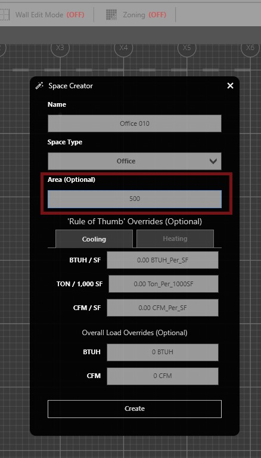
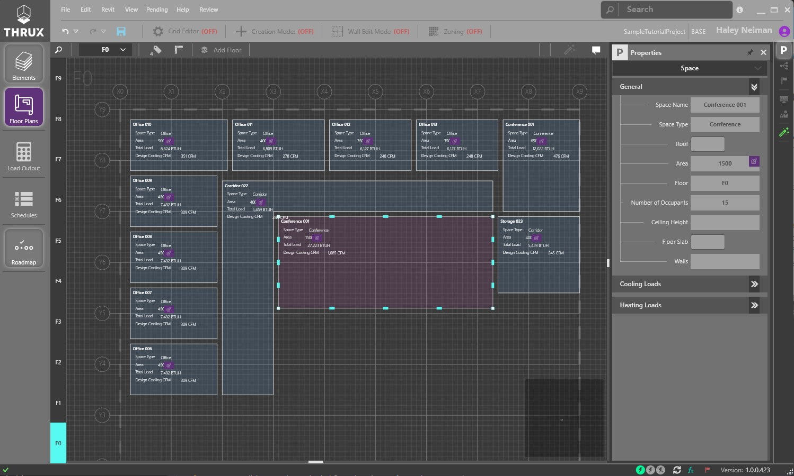
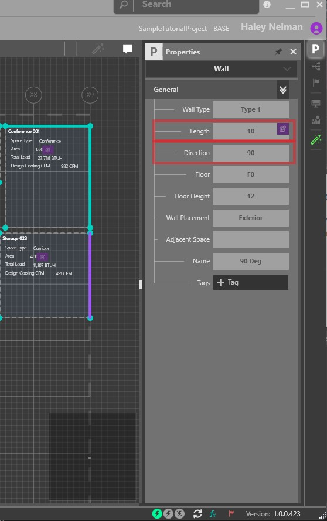

.. _Tips-And-Tricks-For-Manual-Floor-Plans:

#####################################################################################
Tips and Tricks for Using Manually Created Floor Plans for Building Load Calculations
#####################################################################################

When using THRUX for building load calculations, it's always fastest to import an architectural REVIT model into your THRUX model. But in practice, this isn't always an option. The tips and tricks below are meant to help accelerate the process of manually creating architecture in THRUX. 

To get started, follow the steps :ref:`here <Floor-Plans>` to create a grid, floors and start manually creating spaces in your model.  

Manually Creating Rooms
-----------------------

Using room "Creation Mode" you CAN create spaces that exactly match the layout of your floor plans, but that's not necessary. Use the area override property when creating a space in "Creation Mode". The area override allows you to enter a SF used for load calculations, and not waste time perfectly resizing your spaces to geometrically match the floor plans.

When calculating block loads, immediately calculate a load by using the "Rule of Thumb" overrides shown in the screenshot above. Calculate load by using a / SF rule or input an overall BTU/H load for the space. 

Here's an example of a manually created floor plan, with spaces laid out roughly in the proper location.

Creating Walls in a Manually Created Floor Plan
-----------------------------------------------

To create walls, follow the same steps :ref:`here <Wall-Edit-Mode>` to indicate where exterior walls exist in the building. When creating a wall, use the Length and Direction property overrides to indicate the dimensions of the wall. 

Remember, the purple symbol indicates a user override is in place. Click the symbol to reset to the calculated value. 
