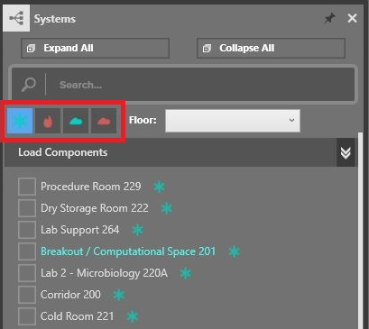

.. _Load_Outputs:

########################
Review Load Calc Results
########################

Review the results of calculations in the Load Output workspace. 

.. figure:: images/loadOutput.jpg
    :align: center
    :alt: Load Output

    Review Load Calculations
    
When the Load Outputs workspace is first opened, the System's Browser will automatically open and dock to the right side of the screen. This browser displays all linkable system components in the model. These can be spaces, zones, generic loads or pieces of equipment. Spaces and Zones are broken out into four separate load components: 

* Cooling Load
* Cooling Ventilation Load
* Heating Load
* Heating Ventilation Load

Each component type can be toggled on/off in the System's Browser by using the toggles (shown below). 

Select a component to view the associated load. 

