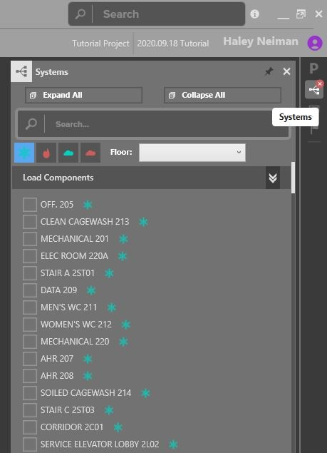
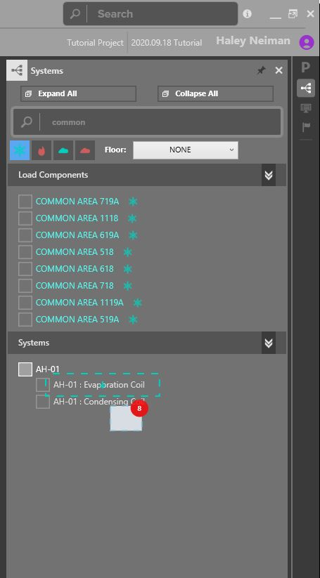

.. _The-Mechanical-Schedules:

##################
Mechanical Systems
##################

Mechanical systems are used to calculate simultaneous peak loads for spaces and zones. Build equipment, connect loads to equipment, and evaluate system loads. 

Creating Mechanical Equipment 
-----------------------------

Build mechanical systems for load calculations by navigating to the schedules, selecting create equipment, and choosing one of the available templates. 

.. figure:: images/MechEquip.png
    :align: center

    Equipment Creation Wizard

Add a unit tag and press create, the newly created schedule will open in the workspace. 

.. figure:: images/MechEquipTemplate.png
    :align: center

    Cooling Air Handler Template

Modify system characteristics from the equipment schedule. Such as unit leaving air temperature. 

.. figure:: images/SDAirHandlerSchedule.JPG
    :align: center

    SD Air Handler Schedule

Connecting Loads To Equipment
-----------------------------

Open the System's Browser to view the loads and equipment in the model. 

    System's Browser

Link loads to equipment by dragging and dropping them from the load section onto an equipment coil. 

    Drag/Drop Functionality