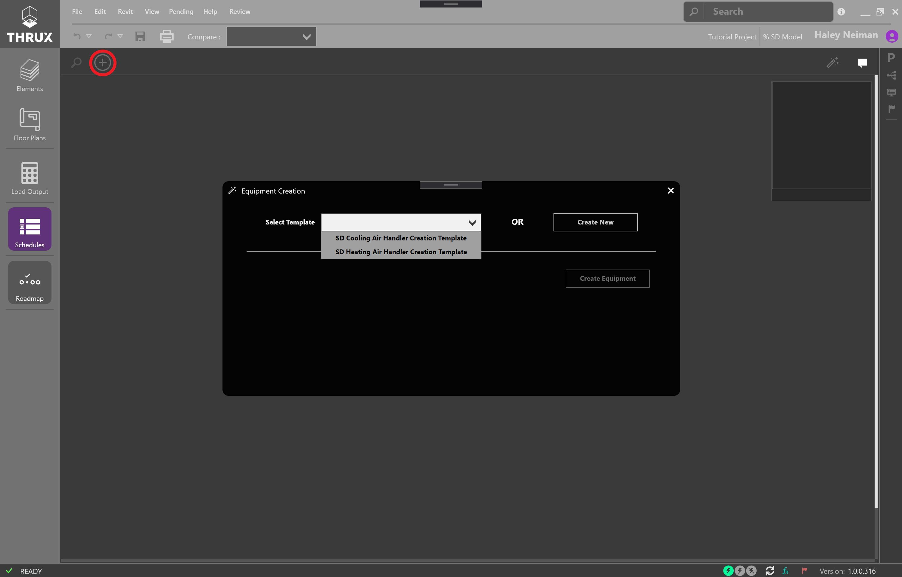
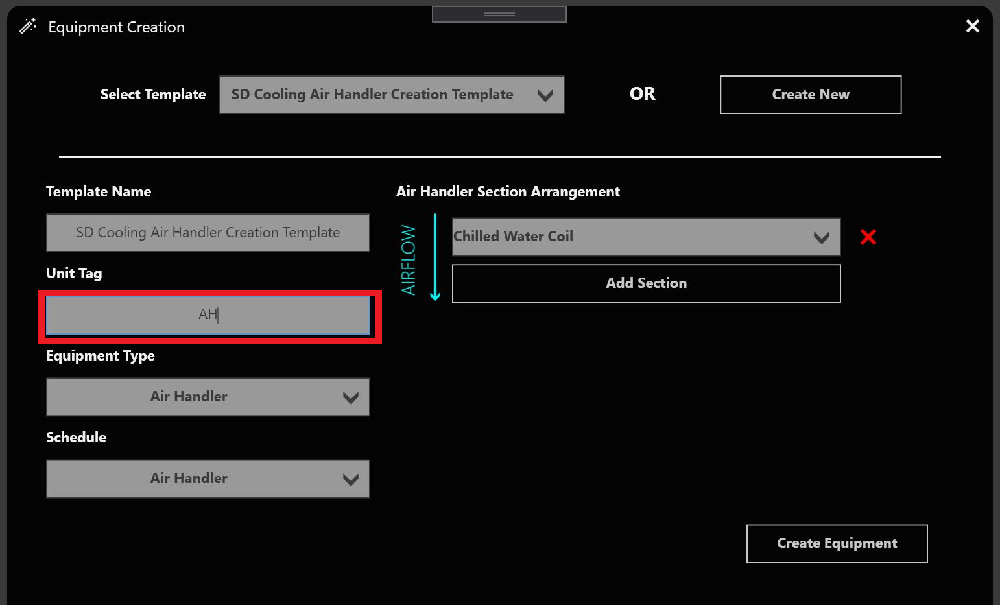
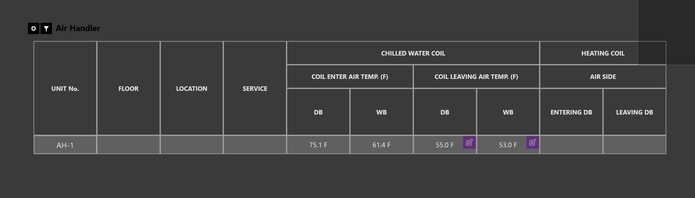

.. _The-Mechanical-Schedules:

#############################
Building Mechanical Equipment
#############################

Build mechanical systems for load calculations by navigating to the schedules, selecting create equipment, and choosing one of the available templates. 

    Equipment Creation Wizard

Add a unit tag and press create, the newly created schedule will open in the workspace. 

    Cooling Air Handler Template

    SD Air Handler Schedule