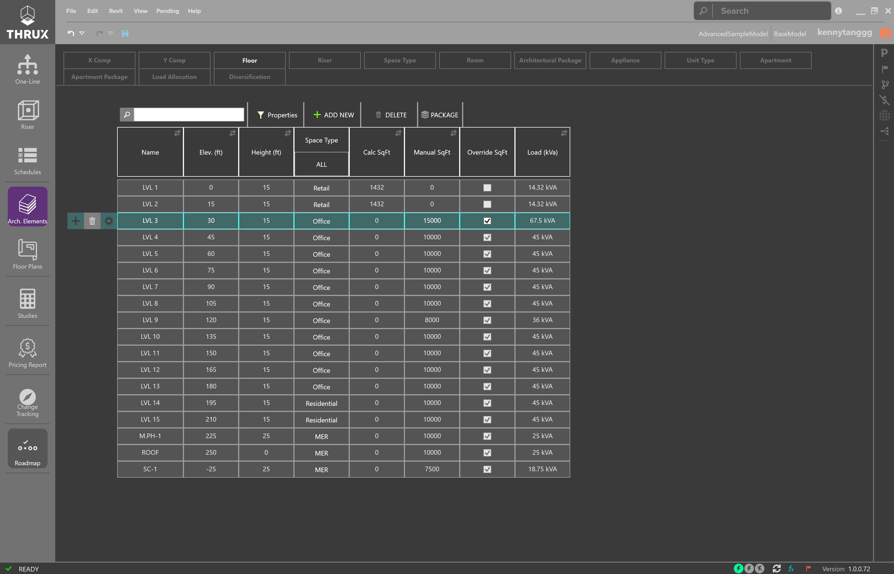
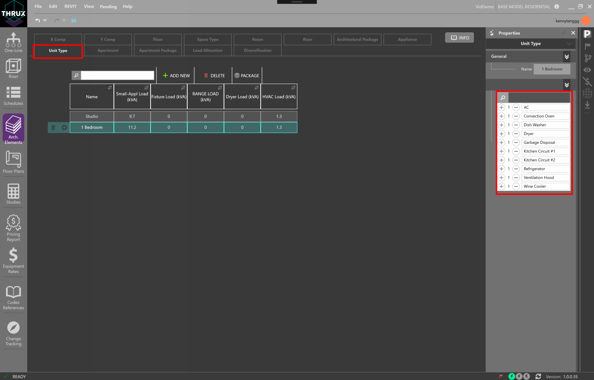
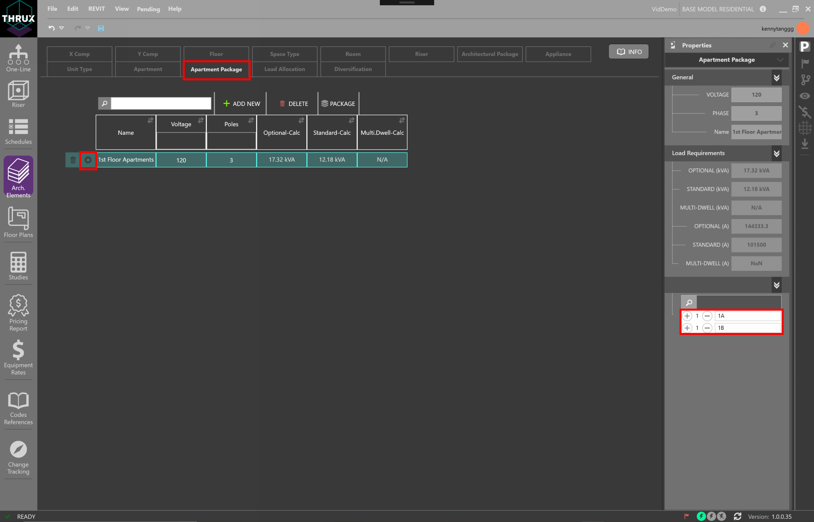

.. _Arch.-Elements:

##################
Elements Workspace
##################

A tabular view into architectural and trade specific elements in the model. Tables are filterable, sortable, and exportable to excel. 

    Viewing Floors in the Architectural Elements Workspace

Useful Commands
---------------

+-----------------------------+-------------------------------------------------------------------------------------------------------------------------------------------------------------------------------------+
| **Command**                 | **Description**                                                                                                                                                                     |
+=============================+=====================================================================================================================================================================================+
| Select All                  | Use CTRL+A to select all entities.                                                                                                                                                  |
+-----------------------------+-------------------------------------------------------------------------------------------------------------------------------------------------------------------------------------+
| Cut/Copy                    | Use CTRL+C to copy and CTRL+C to cut.                                                                                                                                               |
+-----------------------------+-------------------------------------------------------------------------------------------------------------------------------------------------------------------------------------+
| Paste                       | Use CTRL+V to paste.                                                                                                                                                                |
+-----------------------------+-------------------------------------------------------------------------------------------------------------------------------------------------------------------------------------+
| Filtering                   | Filter columns on/off using the sorting button.                                                                                                                                     |
+-----------------------------+-------------------------------------------------------------------------------------------------------------------------------------------------------------------------------------+
| Exporting                   | Use the export button to export your model into .csv, .xml, or .json.  It is also possible to export content by copying and pasting into Excel.                                     |
+-----------------------------+-------------------------------------------------------------------------------------------------------------------------------------------------------------------------------------+

Modeling Residential Loads
--------------------------

Appliances
##########

Appliances are used to calculate the load of residential projects and are grouped by classes as defined by the NEC.  Appliances are assigned to a Unit Type.

Unit Type
#########

Unit Types are used to group Appliances together in order to calculate the load of residential projects.  A Unit Type is assigned to an Apartment.

    Assigning Appliances to a Unit Type

Apartment
#########

An Apartment contains a Unit Type.  It also contains information regarding its location and loading information.  A group of Apartments form an Apartment Package.

Apartment Package
#################

Apartment Packages are used to group Apartments together in order to calculate a load.  

    Assigning Apartments to an Apartment Package

:ref:`Electrical Elements <Electrical_Elements>`
------------------------------------------------

:ref:`Mechanical Elements <Mechanical_Elements>`
------------------------------------------------