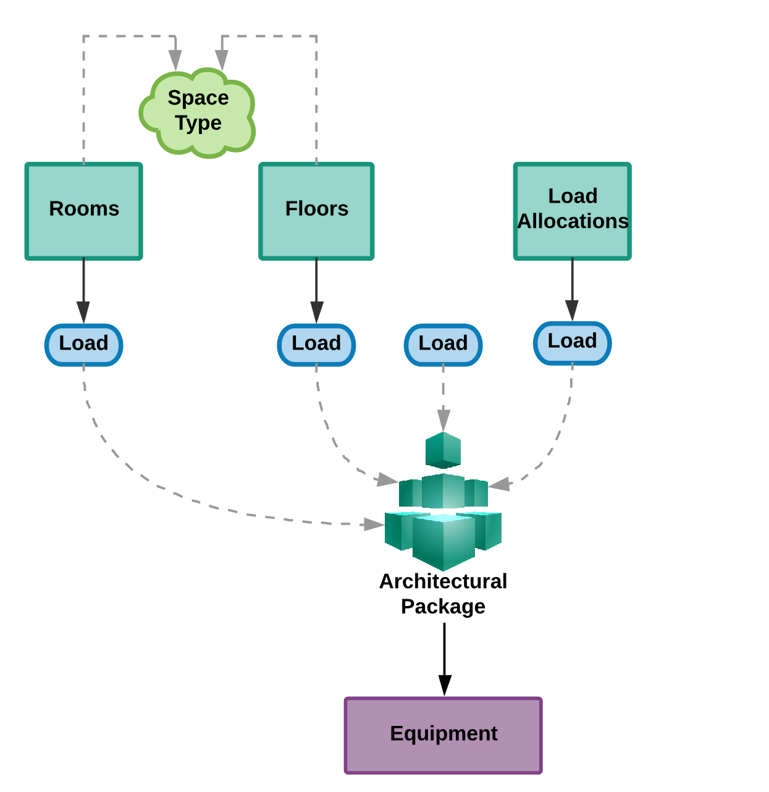
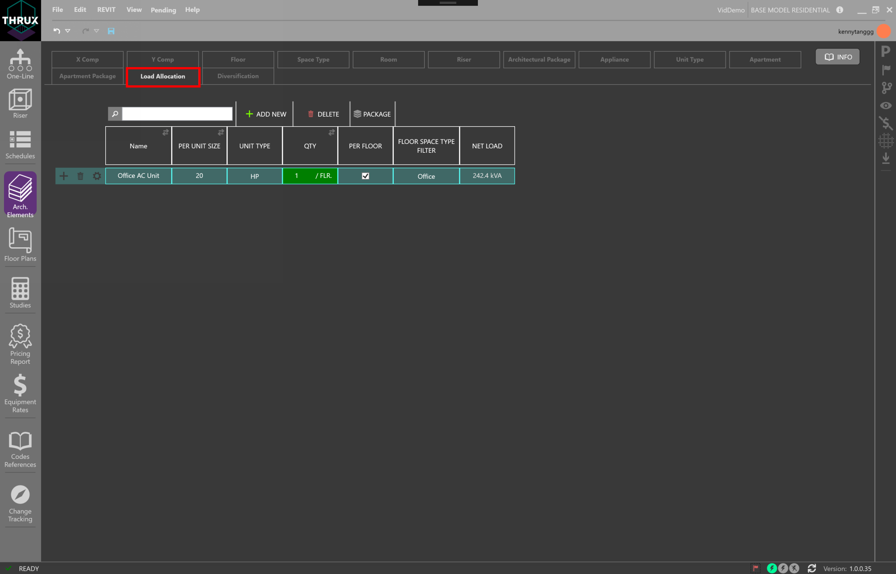
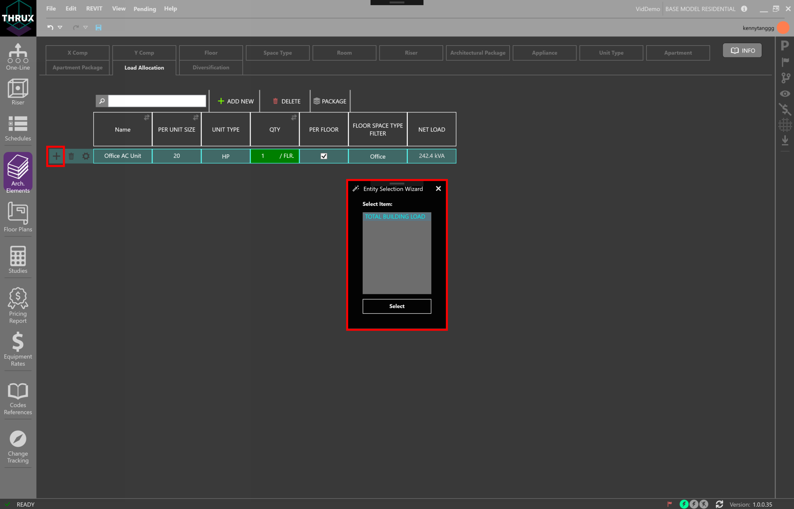
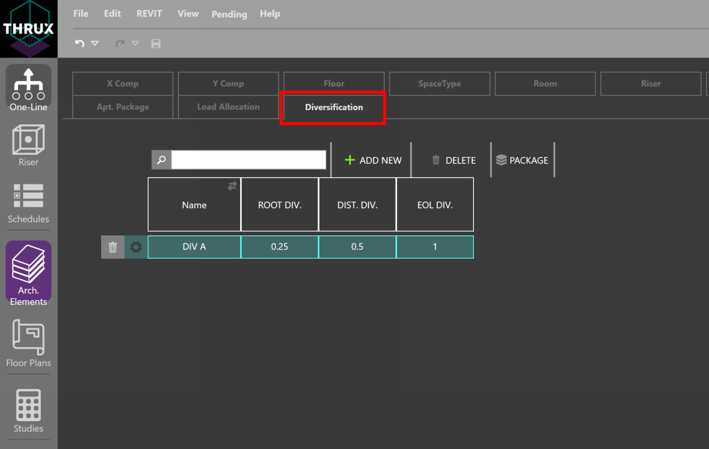
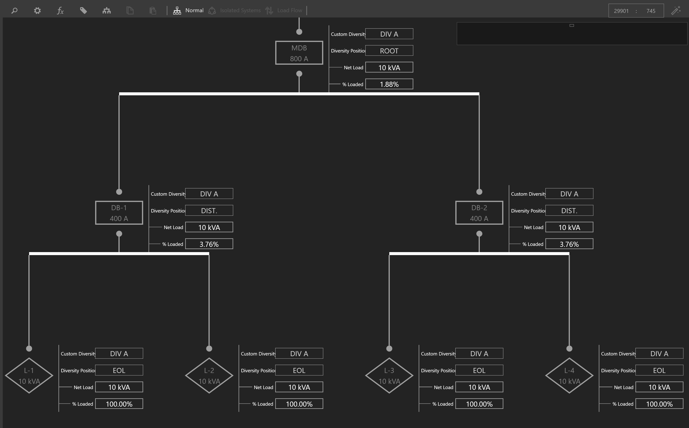

.. _Electrical_Elements:
:orphan:

##############################
Electrical Specific Components
##############################

Loading System
-------------------

You have the ability to abstract the architectural elements of a model to create Load Packages.  Ideally these entities would be abstracted away from a Revit model.  However, during the early stages of development, a Revit model may not exist.

Creation of these architectural entities allow for the THRUX engine to fully utilize its Loading System which applies loading factors dictated by the designer and the Project's applicable safety codes and standards.

    Creating Architectural Packages to model loads

Modeling residential loads relies on creating entities that are based off of the NEC.

.. figure:: images/loading_system-2.PNG
    :align: center
    :alt: loading system

    Creating Architectural Packages to model residential loads

Groups of architectural entities can be created within THRUX, or imported from a Revit model.  Ultimately, Architectural Packages are loads that can be attached to Equipment.

.. _Architectural-Package:

Architectural Packages
----------------------

Architectural Packages are used to model the load or power density of a group of architectural elements.  

For example, a group of Floors could each have their Space Type designated as Office, which has a specific power density.  This group of Floors can be packaged as a load, and fed from distribution Equipment.

Select a group of Floors or Rooms.  Then, in the orange text box, enter a name for the Package and then click the (+) button.  This is packaging a group of Floors as a load.

.. figure:: images/Architectural_Package-1.PNG
    :align: center
    :alt: Architectural_Package

    Creating an Architectural Package for a group of Floors

To view the Package, click the Architectural Package tab.  These loads can be attached to any distribution Equipment in the network.

.. figure:: images/Architectural_Package-2.PNG
    :align: center
    :alt: package

    Viewing the Load of Architectural Packages

.. _Load-Allocation:

Load Allocation
---------------

Load Allocations are used to supplement the Architectural Packages.  In addition to Floor or Room power densities, power can be allocated to specific Floors.

You may want to account for a load that only occurs on Floors of a specific Space Type.  For example, if you wanted to account for a 20 hp motor on every Office Floor, you would need to create a new Load Allocation.  Filter the Load Allocation by the Floor Space Type specified for Office.

    Creating a Load Allocation

Then use the (+) button to associate the Load Allocation with an Architectural Package.

    Allocating additional loads to an Apartment Package

.. _Diversification:

Diversification
---------------

Diversification allows you to create customizable diversity factors which can be applied to different sections or levels of the distribution system.  

A Root Diversity is a factor applied to Root Level loads.  A Root Diversity cannot be less than zero and cannot be greater than the Distribution Diversity.

A Distribution Diversity is a factor applied to Distribution Level loads.

An End-of-Line Diversity is a factor applied to End-of-Line Loads.

    Creating a Custom Diversification Class

In the example below, a Custom Diversity class called DIV A is created and applied to a small distribution network.  

EOL (End-of-Line) , DIST. (Distribution), and ROOT loads have diversity factors of 1.0, 0.5, and 0.25, respectively, applied to them.

At the Diversity Position DIST., or DB-1, a factor of 0.5 is applied to loads L1 and L2, and summed together.  Therefore, the Net Load of DB-1 is 10 kVA.

At DB-2, the same diversities are applied to loads L3 and L4, and the Net Load is also 10 kVA.

At the Diversity Position ROOT, or MDB, a factor of 0.25 is applied to all of its loads, L1, L2, L3, and L4, and summed together.

If any downstream Equipment of MDB has a Load Override value, that value would be diversified instead of the connected load.

    Electrical Distribution Network utilizing a Custom Diversification Class