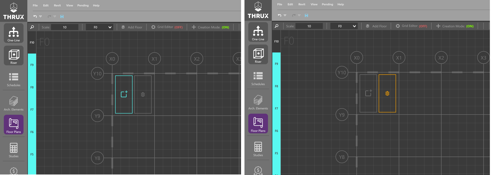
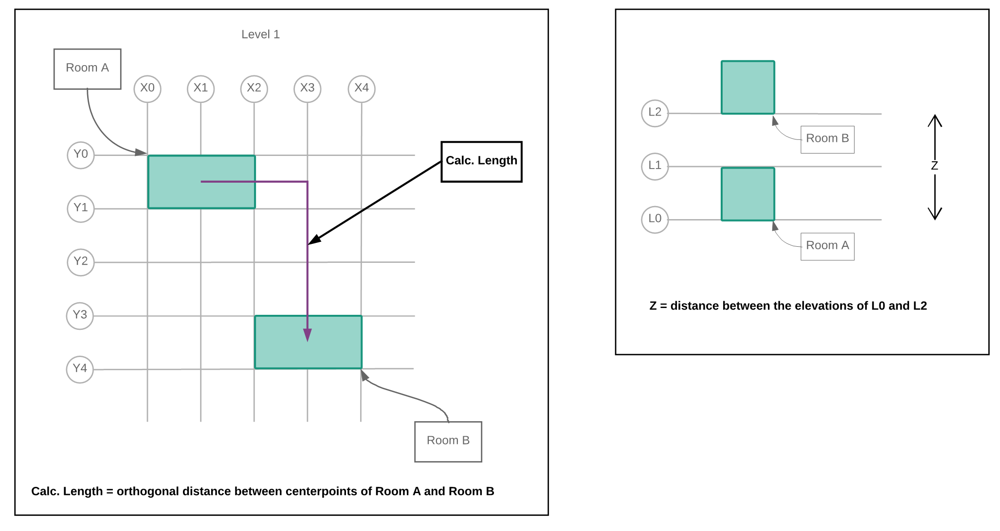

.. _Floor-Plans:

####################
Floor Plan Workspace
####################

The floor plans provide a 2-dimensional window into the geometric constraints of the building. Use the floor plans to modify or create architectural constraints when necessary. 

The best application of the floor plans is always to import an architectural REVIT model (how to :ref:`here <Revit_Interop_Arch_Import>`), but follow the steps below to model the geometry manually if a model doesn't exist. 

Setup Wizard
------------

Use the Setup Wizard located on the right to start to create columns and Floors.  Any entity created using the wizard can also be created or modified in the :ref:`Arch. Elements <Arch.-Elements>` Workspace.

Selecting Create Columns will create multiple columns at a time, and Create Floors will create multiple Floors at a time.  

Click on Create Columns (X) and a wizard will prompt asking for a Prefix, Quantity, Offset, and Starting Dimension.

    Setup Wizard is accessible by clicking on the wand icon in the top right

Offset is the distance in between each column.  The Starting Dimension is the starting X, Y, or Z coordinate.  

Create 11 columns, prefixed with the name "X", with an offset of ten (10), and a starting dimension of zero (0).

    Using the Setup Wizard to create columns

After clicking Create, the columns will appear in the Floor Plans.  

    Columns along the x-axis

Click on Create Columns (Y) to repeat this process.

    Columns along the x-axis and y-axis

Next, click on Create Floors.  Create 11 Floors that are also vertically spaced 10 feet apart.  

Cycle through Floors by selecting the Floor on the left sidebar.

.. figure:: images/setup_wizard-5.PNG  
    :align: center

    100 foot by 100 foot by 100 foot building

Grid Editor
-----------

Use the Grid Editor to modify the spacing in between columns.  Click on the gear icon to use the Grid Editor.

    Grid Editor is active

Use the grips to drag columns and change their dimensions.  When finished, click on Accept or Reject to save or cancel your changes.

    Dragging a grip shows all associated dimensions

Creation Mode
--------------

Once Floors are created, enable Creation Mode.  This allows you to create Rooms and Risers.

Create a room by creating a modifiable polygon. Click the screen to create vertices, press enter to close the line and create the room. A pop up will appear, prompting you to input the room name and trade specific information.

    Creating a Room with Creation Mode enabled

To resize a Room, disable Creation Mode and select a room, the vertices and edges will enable allowing you to reshape them.

    Click and drag the grips to resize a Room

NOTE: If working in the Mechanical module, check the :ref:`Tips and Tricks Page <Tips-And-Tricks-For-Manual-Floor-Plans>` for trade specific guidance. 

Select multiple Floors by using Shift+Click.  Then hover over a grid region and select Add Room or Add Riser.

While multiple Floors are selected, selecting Add Room will create a Room in a common location which spans the selected Floors.

Create Riser will create a Riser which also spans the selected Floors.  

    Creating a stacked Room or a Riser while multiple Floors are selected

.. _Add-Floor:

Another way to create Floors is to use the Add Floor button.

.. figure:: images/add_floor-1.PNG
    :align: center

    Add Floor

    Adding a Roof at an elevation of 1100 feet

.. index: How are equipment distances determined?

.. _Floor-Plans-Move_Equipment:

Move Equipment
--------------

It is a common task to study changing the locations of Equipment.  Move Equipment is intended to quickly place Equipment in Rooms.  

    Click Move Equipment in the top right

There are two collections of Equipment: Orphaned Equipment and Hosted Equipment.  

An Orphaned Equipment does not have a Room assigned to it while a Hosted Equipment has a Room assigned to it.

    Orphaned Equipment vs Hosted Equipment

Select a single piece of Equipment or multiple at a time.  Rooms and Floors will be highlighted.  

Hover over a Room and click the Move/Add icon.

    Highlighted regions are areas where an Equipment can be placed

Distance Measurements
---------------------

.. _Calculated-Length:

^^^^^^^^^^^^^^^^^^^^^^^^
Calculated Length
^^^^^^^^^^^^^^^^^^^^^^^^

Distances between Equipment are determined by their respective Room locations.  Calc. Length (Calculated) represents the distance between two Rooms via an orthogonal route.

The vertical distance between Rooms is the difference between their respective elevations.

    Route between Rooms on the same Floor, and vertical distance between stacked Rooms

It is often necessary to offset through a Riser.  The total distance or :ref:`Net Length <Net-Length>` is determined by the centerpoints of the respective entities.

.. figure:: images/equipment_distances-2.PNG
    :align: center
    :alt: equip distance

    Routing from Room A, through Riser A, and terminating at Room B

.. _Manual-Added-Length:

^^^^^^^^^^^^^^^^^^^^^^^^
Manual Added Length
^^^^^^^^^^^^^^^^^^^^^^^^

Manual Added Length is an additional factor which is added to a circuit's :ref:`Calc. Length <Calculated-Length>` property and is a customizable default setting.  See :ref:`here <Default-Model-Parameters>` for more information.

.. _Net-Length:

^^^^^^^^^^^^^^^^^^^^^^^^
Net Length
^^^^^^^^^^^^^^^^^^^^^^^^

The Net Length is composed of the :ref:`Calc. Length <Calculated-Length>` and the :ref:`Manual Added Length <Manual-Added-Length>`.

Useful Commands
---------------

+-----------------------------+-------------------------------------------------------------------------------------------------------------------------------------------------------------------------------------+
| **Command**                 | **Description**                                                                                                                                                                     |
+=============================+=====================================================================================================================================================================================+
| Select All                  | Use CTRL+A to select all entities.                                                                                                                                                  |
+-----------------------------+-------------------------------------------------------------------------------------------------------------------------------------------------------------------------------------+
| Cut/Copy                    | Use CTRL+C to copy and CTRL+C to cut.                                                                                                                                               |
+-----------------------------+-------------------------------------------------------------------------------------------------------------------------------------------------------------------------------------+
| Paste                       | Use CTRL+V to paste.                                                                                                                                                                |
+-----------------------------+-------------------------------------------------------------------------------------------------------------------------------------------------------------------------------------+
| Find                        | Use CTRL+F to search.                                                                                                                                                               |
+-----------------------------+-------------------------------------------------------------------------------------------------------------------------------------------------------------------------------------+
| Zoom Extents                | Double-click the mouse wheel to zoom and pan to the extents of the window content.                                                                                                  |
+-----------------------------+-------------------------------------------------------------------------------------------------------------------------------------------------------------------------------------+

:ref:`The Mechanical Floor Plans <The-Mechanical-Floor-Plans>`
--------------------------------------------------------------