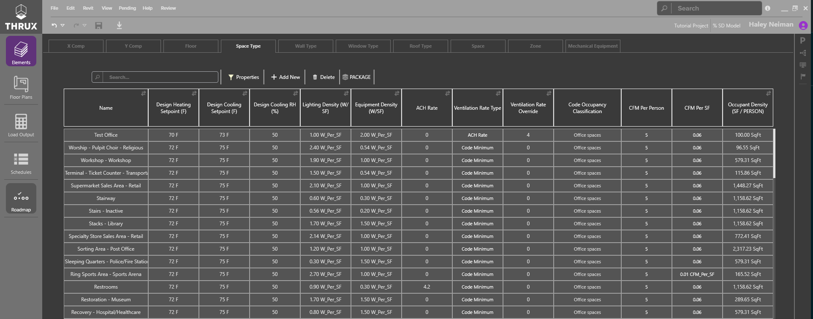

.. _Mechanical_Elements:
:orphan:

###################
Mechanical Elements
###################

Space Types
-----------

Mechanical Space Types are templates for the spaces or rooms in the model. Space Types define the loading, temperature setpoints and occupancy types for spaces. 

    Mechanical Space Types

.. csv-table:: Space Type Properties
   :file: images/SpaceTypeProperties.csv
   :widths: 30, 70
   :header-rows: 1

Wall Types
----------

Wall Types are templates applied to the walls in project. They specify wall construction characteristics. These templates can be associated to individual walls in the floor plans. 

.. csv-table:: Wall Type Properties
    :file: images/WallTypeProperties.csv
    :widths: 30, 70
    :header-rows: 1

Window Types
------------

Window Types are templates applied to the glazing portion of walls in the project. They specify the glass construction characteristics. Window Types are linked to Wall Types in the Wall Type tab. 

.. csv-table:: Window Type Properties
    :file: images/WindowTypeProperties.csv
    :widths: 30, 70
    :header-rows: 1

Roof Types
----------

Roof Types are templates applied to the roofs in the project. These define the roof construction characteristics. 

.. csv-table:: Roof Type Properties
    :file: images/RoofTypeProperties.csv
    :widths: 30, 70
    :header-rows: 1

Spaces
------

Spaces are rooms, defined and created visually in the floor plans (or imported from REVIT). The elements Space table is a good place to make bulk edits to the properties of multiple spaces at once. More information about space loads can be displayed by toggling on more properties. Many find it helpful to export this table to excel. 

.. csv-table:: Space Properties
    :file: images/SpaceProperties.csv
    :widths: 30,70
    :header-rows: 1

Zones
-----

Mechanical Equipment
--------------------