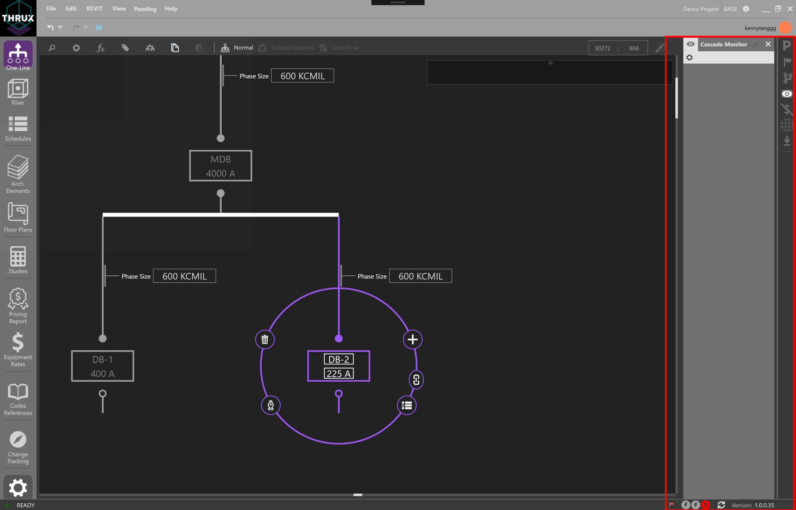
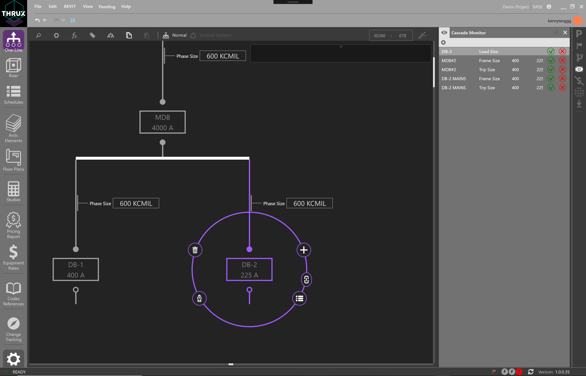

.. _Cascade-Monitor:

Cascade Monitor
---------------

Systems are interrelated, and it is important to be aware of how each system may respond to certain changes.  

For example, changing the Load Capacity of a Distribution Board would cause a recalculation of the conductor arrangement of the circuit, including the conduit size.  

A designer may like to view items which change as a result of a single change.  Think of this as viewing the cascading impacts.

The Cascade Monitor works with :ref:`Design Assistance <Design-Assistance>` and allows the ability to respond to these cascading impacts by manually accepting or rejecting them.  

Open the Cascade Monitor and turn off Design Assistance.

    Cascade Monitor with No Design Assistance

See the example below which shows the impacts, or cascading effects, of a decrease in the Load Capacity of a Distribution Board. 

A reduction in Load Capacity will result in a reduction of the protective devices trip size, which will result in a reduction in phase size for the conductor arrangement.

    Changing the Load Capacity while the Cascade Monitor is active

