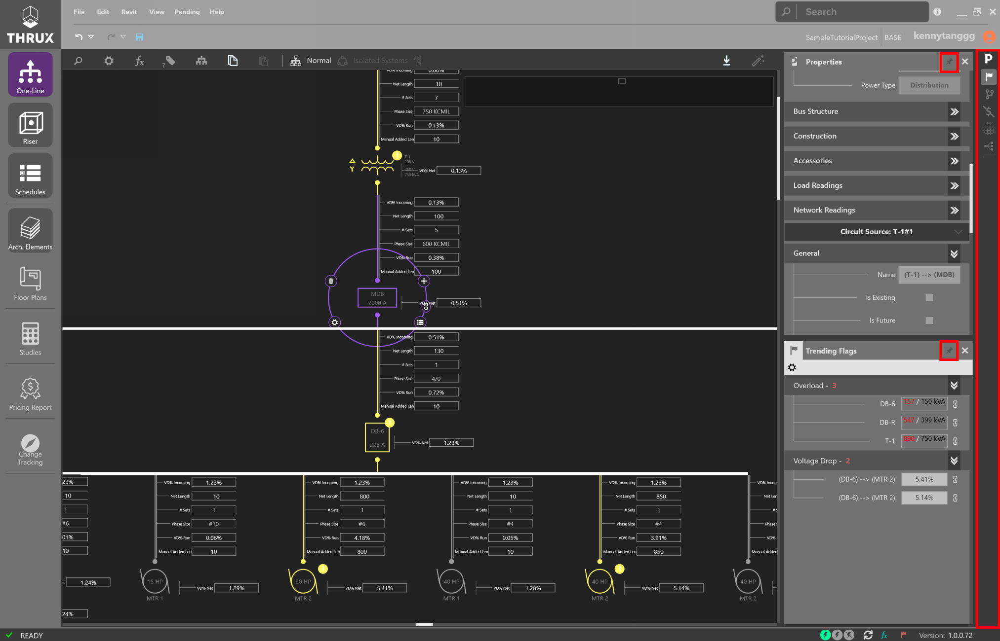
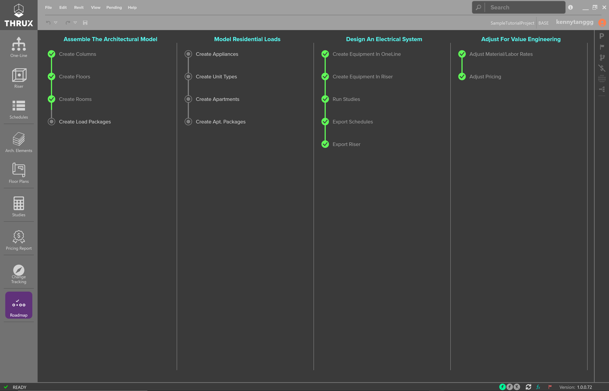

.. _User-Guide:

**Signing In**
================

Once the application is open, sign in with your account.

.. figure:: images/SignIn.PNG
    :align: center
    :alt: sign in 
    
    Sign In at the Top Right

**Navigating THRUX**
====================

.. _Workspace-Toolbar:

#################
Workspace Toolbar
#################

The left-side toolbar is the Workspace Toolbar.  The purple shading indicates an open and active Workspace, while grey shading only indicates an open Workspace.  

    Workspace Toolbar

Workspaces can be detached to separate windows by clicking and dragging the Workspace's icon in the Workspace toolbar.  

These windows can be docked by clicking Dock in the top right of the undocked window.

.. figure:: images/workspace-toolbar-dock.PNG
    :align: center
    :alt: toolbar

    Docked One-Line separate from the main application

.. figure:: images/workspace_docking.PNG
    :align: center
    :alt: dock

    Docking Workspaces allows Workspaces to be viewed on multiple monitors

################
Explorer Toolbar
################

Explorers and other Utility tools can be found on the :ref:`Explorer Toolbar <Explorer-Toolbar>` on the right-side toolbar.  These tools can be pinned to always be visible (pin icon).

    Using the :ref:`Properties Explorer <Properties-Explorer>` and :ref:`Flag Tracker <Flag-Tracker>` while working in the :ref:`One-Line <One-Line>` Workspace

.. _Navigation-Bar:

##################
Navigation Bar
##################

Designers have the ability to search for anything within the model.

For example, if searching for a piece of Equipment, simply type the name.

Options will be displayed where something is found.  
 
.. figure:: images/navigation_bar-1.PNG
    :align: center
    :alt: nav bar

    Navigation Bar

Selection will navigate you to the location within the application.

.. figure:: images/navigation_bar-2.PNG
    :align: center
    :alt: nav bar

    Navigating to the Schedule for MDB-1

####################
Additional Commands
####################

Zoom Extents allows the user to quickly pan to the center of the screen.  Double click the mouse wheel to Zoom Extents.

.. index:: Getting Started

**Creating a New Project**
==========================

Click the Home button, and then the Add (+) button to create a new Project.

    The Home Screen is a Project portal that provides quick access to recent Projects

##############################
Opening an Existing Project
##############################

Existing projects or recently opened projects are shown below the Open Project section.

.. figure:: projectsettings/images/open_project-1.PNG
    :align: center
    :alt: open project

    Check the recently opened lists to pick up where you left off

.. _Project-Settings:

################
Project Settings
################

Project Settings are a set of customizable parameters on which to base the design.

    Project Settings are accessible by clicking on File, and then Settings

.. toctree::
    :maxdepth: 2

    projectsettings/defaultmodelparameters/index-default_model_parameters
    projectsettings/calculationsettings/index-calculation_settings
    projectsettings/autosizingfilters/index-auto_sizing_filters
    projectsettings/flagsettings/index-flag_settings
    projectsettings/customdesignassistancesettings/index-custom_design_assistance_settings
    projectsettings/laborrates/index-labor_rates

##############
Roadmap
##############

To help guide the design process, refer to the Roadmap.  Clicking on each node will bring you to that process.

    Roadmap

.. _Define_Architecture:

**Define Architecture**
=======================

The goal of the Architectural Workspaces, :ref:`Floor Plans <Floor-Plans>` and :ref:`Elements <Arch.-Elements>`, is to provide to visualize building geometry and complete load massing.

For electrical projects, you may not find it necessary to set up these Workspaces and instead, find it faster to manually input feeder lengths in the :ref:`One-Line <One-Line>`.  

Architectural contraints can be :ref:`imported <Revit-Interoperability>` from an Architectural Revit model or created manually. 

The :ref:`Elements <Arch.-Elements>` Workspace allows you to modify the architectural elements of the model, like floors or rooms/spaces. 

These elements can be created in the :ref:`Floor Plans <Floor-Plans>` Workspace, or the :ref:`Elements <Arch.-Elements>` Workspace.

.. toctree::
    :maxdepth: 2

    definingarchitecturalelements/archelements/index-arch-elements
    definingarchitecturalelements/floorplans/index-floor-plans

.. _Electrical-Workspaces:

**Building the Electrical Model**
=================================

###################
Overview
###################

There are three (3) main Workspaces to build the electrical system.  

These include: :ref:`Riser <Riser>`, :ref:`One-Line <One-Line>`, :ref:`Schedules <Schedules>`.  

Reports of a model can be generated at any time using the :ref:`Studies <Studies>` Workspace.  

Hosted vs. Unhosted Systems
--------------------------- 

If a piece of Equipment is not fed from a source, then it is designated as Unhosted.  During the stages of design, it is common to model hypothetical scenarios before all information is known.  For example, as part of a larger project, an Architect may decide to create a space dedicated for a computer lab, but not yet decide on its exact location.  While the location is not yet finalized, you can still model an Unhosted System with the intent of attaching the system to the main network in the future.  Modeling Unhosted Systems allows flexibility when the source of a network is not yet known or if you want to create segregated distribution networks and tie them together at a later time.

####################
Riser
####################

.. toctree::
    :maxdepth: 2

    buildingelectricalmodel/riser/index-riser 

####################
One-Line
####################

.. toctree::
    :maxdepth: 2

    buildingelectricalmodel/one-line/index-one-line

####################
Schedules
####################

.. toctree::
    :maxdepth: 2

    buildingelectricalmodel/schedules/index-schedules

####################
Flag Tracker
####################

.. toctree::
    :maxdepth: 2

    buildingelectricalmodel/flagtracker/index-flag_tracker

########
Studies
########

.. toctree::
    :maxdepth: 2

    buildingelectricalmodel/studies/index-studies

**Building the Mechanical Model**
=================================

Complete building load calculations using the THRUX Mechanical engine. 

.. toctree::
    :maxdepth: 2

    definingarchitecturalelements/mechanical/index-mechanical_elements
    buildingmechanicalmodel/floorplans/index-mech_floor_plans
    buildingmechanicalmodel/schedules/index-mech_schedules
    buildingmechanicalmodel/loadoutputs/index-mech_load_outputs

**Building the Plumbing and Fire Protection Model**
====================================================

Coming soon!

.. toctree::
    :maxdepth: 2

    buildingpfpmodel/index-building_pfp_model

.. _Pricing-Model:

**Pricing Model**
====================

The Pricing Model is built around the Electrical model and can be viewed in a few Workspaces.  The :ref:`Price Tracker <Price-Tracker>` is used to live monitor the price of the model.  For example, as you change the location of a major equipment room, the Price Tracker would display order of magnitude estimates for that change.  For a more complete tabular report, use the :ref:`Pricing Report <Pricing-Report>` Workspace.

:ref:`Equipment Rates <Equipment-Rates>` is a customizable catalog which composes the bid for materials.
 
.. toctree::
    :maxdepth: 3

    pricingmodel/pricingreport/index-pricing_report
    pricingmodel/pricetracker/index-price_tracker
    pricingmodel/equipmentrates/index-equipment_rates

.. _Project-Management:

**Project Management**
======================

Engineers are often tasked to study different alternatives or schemes and present them to the Owner.  

The :ref:`Issuance Log <Issuance-Log>` allows you to create Branches, while the :ref:`Change Tracking <Change-Tracking>` Workspace allows you to compare Branches against the base Branch.

.. figure:: projectmanagement/images/project_management-1.PNG
    :align: center
    :alt: project management

    Project Management tools - Issuance Log, Change Tracking

.. toctree::
    :maxdepth: 3

    projectmanagement/issuancelog/index-issuance_log
    projectmanagement/changetracking/index-change_tracking
    projectmanagement/accessibility/index-accessibility

.. _Explorer-Toolbar:

**Explorers and other Utility Tools**
============================================

The right-side toolbar of THRUX is generally where the explorers or utility tools are located.  Explorers can be pinned to always be visible while other explorers are being used.

.. figure:: explorersandutilitytools/images/explorersandutilitytools-1.PNG
    :align: center
    :alt: explorers 

    Explorer Toolbar

.. toctree::
    :maxdepth: 2

    explorersandutilitytools/propertiesexplorer/index-properties_explorer
    explorersandutilitytools/cascademonitor/index-cascade_monitor
    explorersandutilitytools/dataexporter/index-data_exporter
    explorersandutilitytools/codesreference/index-codes_reference
    explorersandutilitytools/statusbar/index-status_bar

.. _Recovery-Options:

**Recovery Options**
====================

THRUX models are stored in the cloud and are periodically backed up. You can revert a model to a previous point in time via the Open Project window. Select your project and use the Restore command on the model you wish to roll back.

.. figure:: recoveryoptions/images/restore-3.PNG
    :align: center
    :alt: restore

.. _Release-Data:

**Automatic Updates**
=====================

Whenever THRUX is opened, it automatically searches for updates.  

Refer to the Version Number in the bottom right of the :ref:`Status Bar <Status-Bar>`. 

.. figure:: automaticupdates/images/version.PNG
    :align: center
    :alt: updates

To see an outline of updates between each Version, click on the information icon located in the top-right of the top menu bar. 

.. figure:: automaticupdates/images/release_data-1.PNG
    :align: center
    :alt: release data

Use the arrows to navigate between each Version.

.. figure:: automaticupdates/images/release_data-2.PNG
    :align: center
    :alt: release data

.. _Revit-Interoperability:

**Revit Interoperability**
==========================

The Architectural information which comprise the Architectural Workspaces, :ref:`Arch. Elements <Arch.-Elements>` and the :ref:`Floor Plans <Floor-Plans>`, can be imported from a Revit model.

In addition, a THRUX model can be exported to Revit.  You can then fine-tune Equipment locations using Revit, and verify the integrity of the design using THRUX.

.. figure:: images/revit-interop-1.PNG
    :align: center
    :alt: revit interop

.. _AutoCAD-Interoperability:

**AutoCAD Interoperability**
============================

:ref:`Schedules <Schedules>` are exportable to AutoCAD or Excel.

.. figure:: buildingelectricalmodel/schedules/images/schedules-exporting-1.PNG
    :align: center
    :alt: schedules

    Exporting Schedules to AutoCAD

.. figure:: buildingelectricalmodel/schedules/images/schedules-exporting-2.PNG
    :align: center
    :alt: cad

    Exporting Schedules to AutoCAD