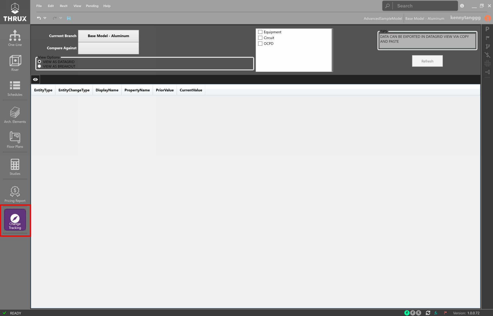
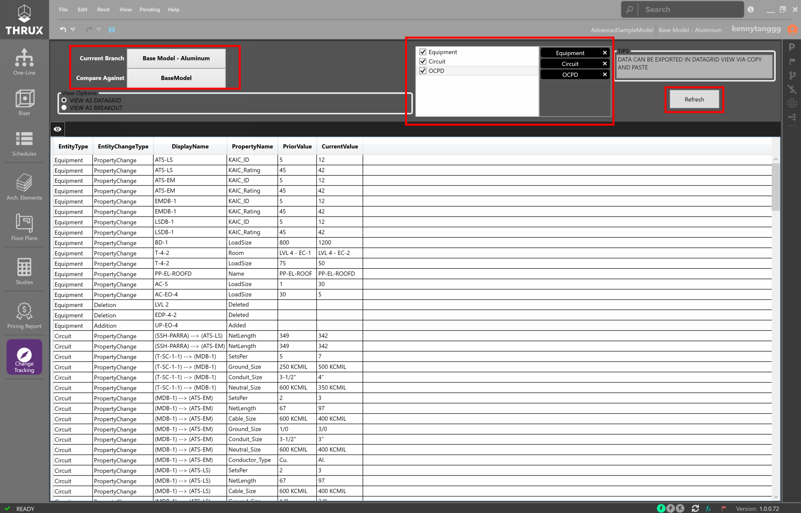

.. _Change-Tracking:

Change Tracking
---------------

Change Tracking allows the designer to compare changes between Branches.

    Utilizing the Change Tracking Workspace

Select the Branch to compare against the current Branch.  Select the entities to compare against and select Refresh.  This list can be exported to .csv (Excel) by using Copy and Paste.

    Comparing a Branch against the base Branch
