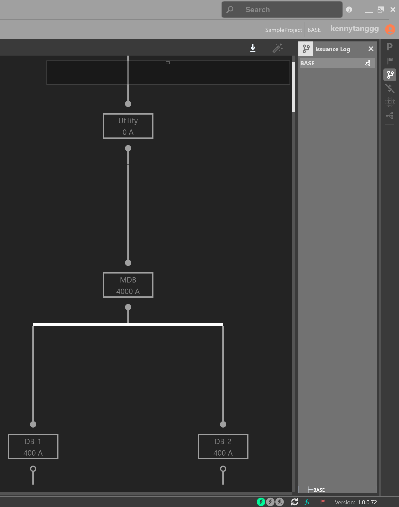
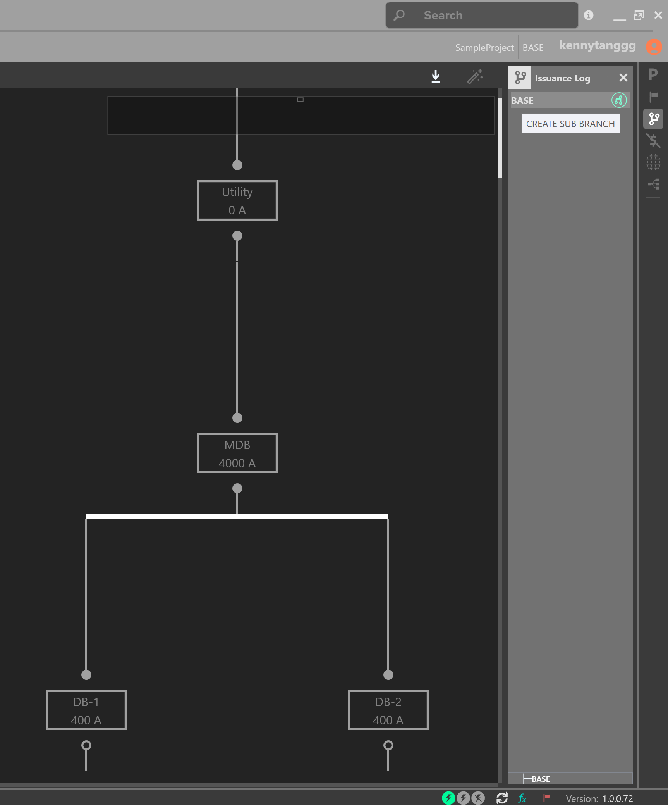
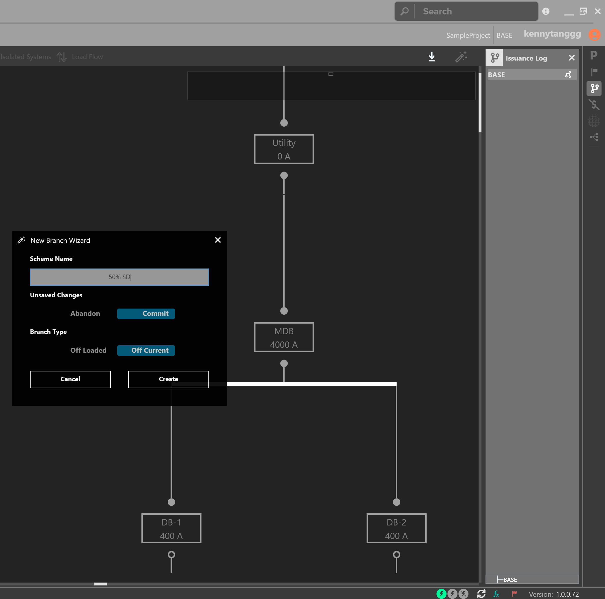
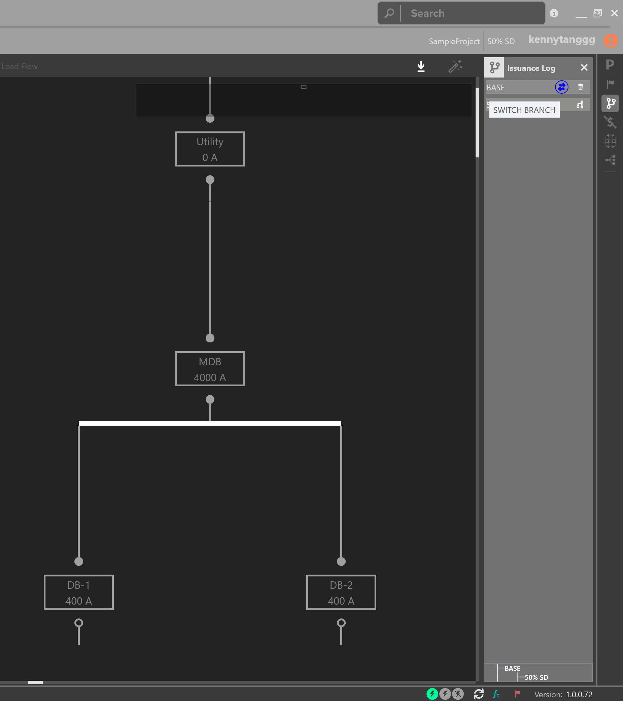
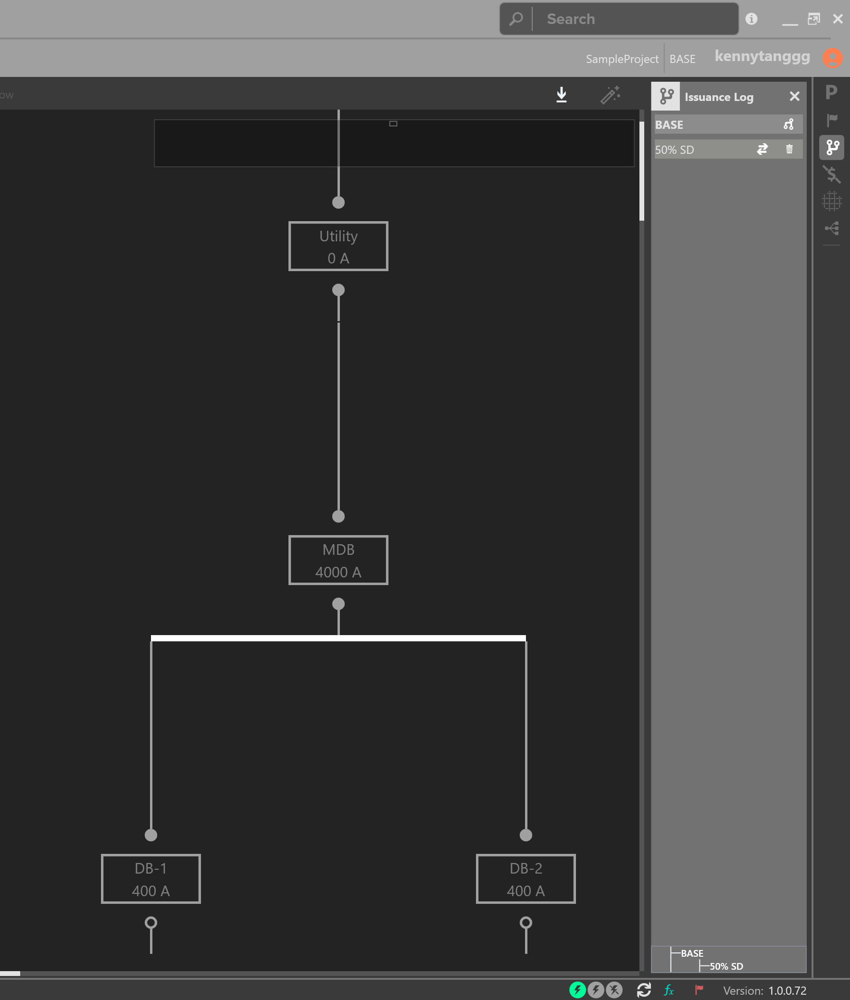

.. _Issuance-Log:

Branching
---------

Designers are often tasked to study different options in order to determine the best option for the Owner.  The :ref:`Issuance Log <Issuance-Log>` is a tool which allows the designer to create Branches of their model.  

The initial Base scheme is also known as the Base Issuance, and should be the primary working Branch.  If a designer is asked to study an alternative option, create a Branch.  Designers can switch between Branches as necessary.

To create a Branch, open the Team Explorer on the right sidebar.  

    The Active Issuance is displayed in the top right of the application

Click the branch symbol to create a Sub-Branch. 

    Creating a Sub-Branch off of the Base Branch

Give the Branch a name and click on Create.  By default, a Branch will be created off of the current working model.

You have the option to ignore or abandon any changes since you last saved, or since you opened the Project.  This is also known as the current working model, or off of the last saved model.  

    Using the New Branch Wizard

Swap between Branches by clicking the arrow symbols.  Note the active Branch is shown in the top right navigation bar.  A Branching map is displayed at the bottom of the Issuance Log.  Note the differences between the two One-Lines of each Branch.

    Switching between Branches

    Switching between Branches

In addition, designers can compare changes between Branches, by using the :ref:`Change Tracking <Change-Tracking>` Workspace.