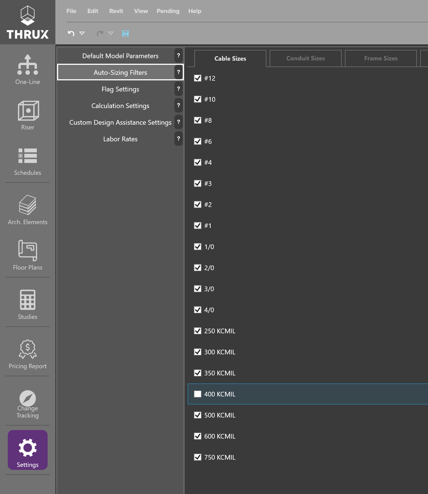

.. _Auto-Sizing-Filters:

Auto-Sizing Filters
===================

Auto-Sizing Filters present designers with an option to restrict certain materials from being used in the design.  

Depending on the level of Design Assistance, the THRUX engine will be filling out certain parameters when enough information is specified to alleviate repetitive hand calculations.  

For example, if a designer is specifying a 400A distribution board, THRUX will calculate the circuit's minimum conduit size to be 3-1/2" conduit (would vary on additional parameters).  However, if a designer wants to use only 4" conduits in favor of 3-1/2", due to a Contractor's request, 3-1/2" can be unchecked from the Conduit Sizes and THRUX will choose the next available checked size up from code-minimum.  

    Auto-Sizing Filters - Omitting a 400 kCMil cable from the design