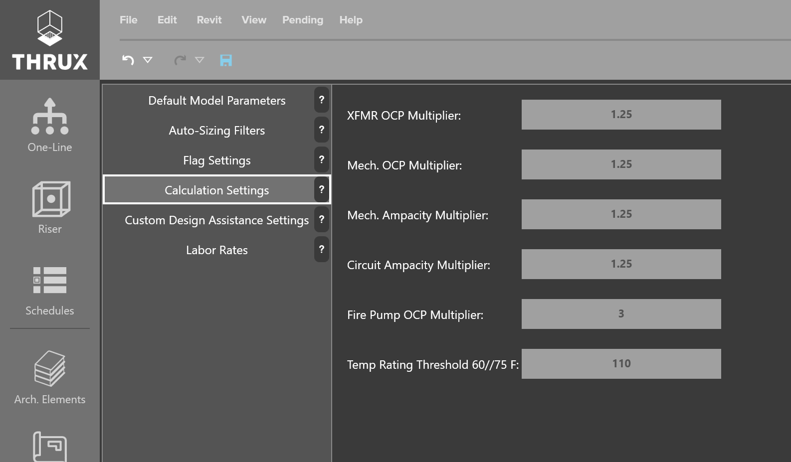

.. _Calculation-Settings:

Calculation Settings
====================

Specify additional calculation settings here.

For example, the Temperature Rating Threshold (NEC Table 310.15(B)) for conductors can be specified here.  The default is 110 amps.

    Calculation Settings

For more information on these calculation settings see :ref:`here <Calculation-Settings-Definitions>`.