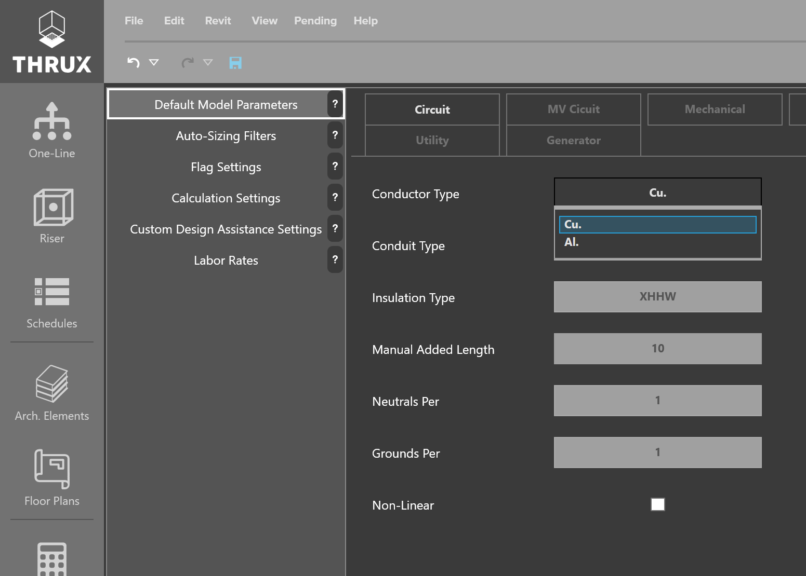

.. _Default-Model-Parameters:

Default Model Parameters
========================

The entities or objects used to build the model need to have some initial or base information.  Every time a new entity is created it will default to these parameters.  These settings are meant to mimic the consulting Engineer's specifications.  As more updates are made in the future, this section will be expanded to encapsulate more typical statements in MEP building specifications.  For example, all distribution boards can be modeled to default to having an isolated ground bus.

    Setting the default Conductor Type for all circuits to be copper (Cu.)

For more information about these default parameters, or Equipment properties and definitions, click :ref:`here <Default-Model-Parameters-Definitions>`, or see our :ref:`Definitions <Definitions>` section.
