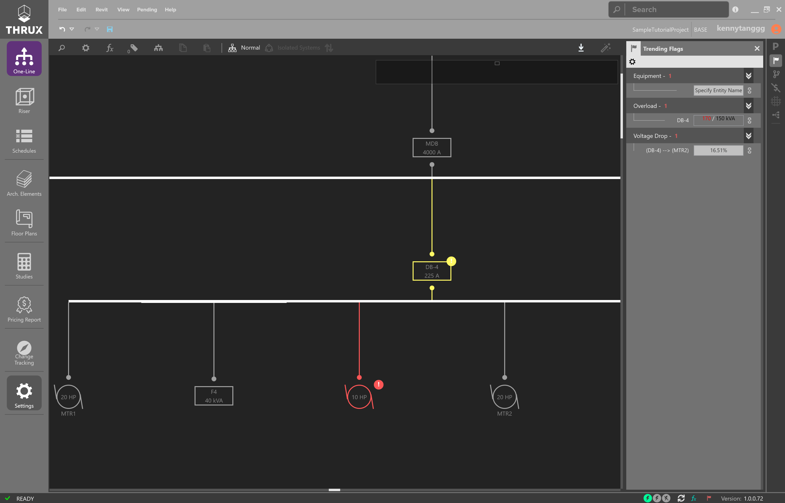

.. _Flag-Settings:

Flag Settings
=============

THRUX provides code-validated designs and presents designers with notifications or Flags if a scenario is violating a Project's applicable safety code or standard.  Certain Flags can be ignored or have the visibility setting omitted.  Deselect to omit a Flag.

Yellow Flags are warnings of violations of applicable safety codes.  

Orange Flags are violations of applicable safety codes.

Red Flags are program errors, such as a piece of Equipment without a name.

    Identifying Overload and Voltage Drop Flags while creating the One-Line

For more information about Flags and their conditions, see :ref:`Flag Settings Definitions <Flag-Settings-Definitions>`.