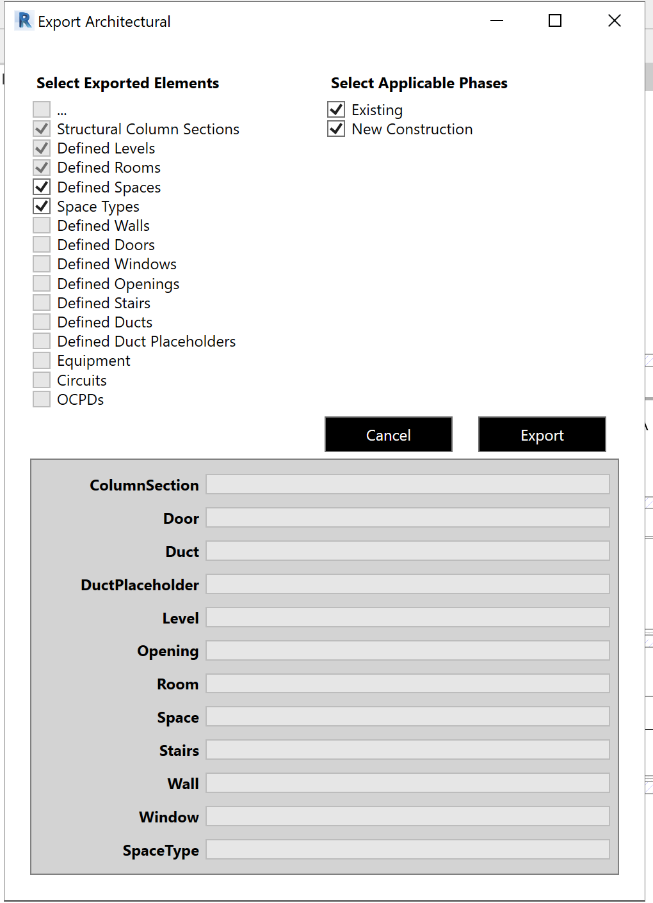
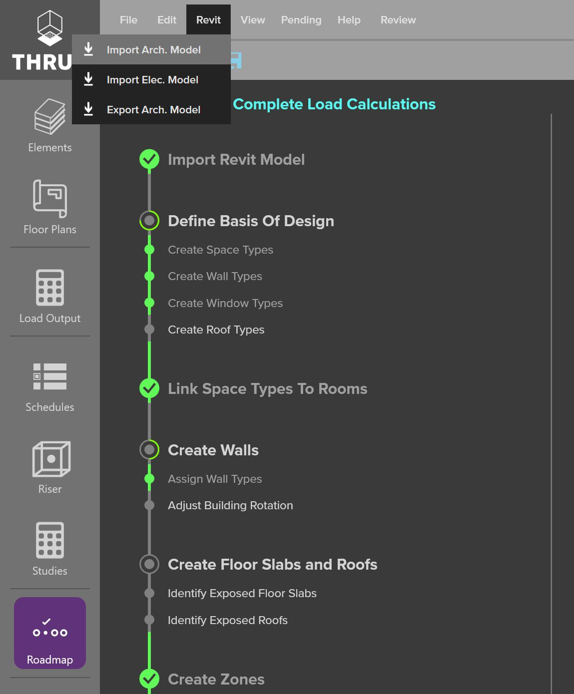

.. _Revit_Interop_Arch_Import:

########################################
Import an Architectural Model from REVIT
########################################

Link an architectural revit model to THRUX. 

1. Login to the THRUX `Account Portal <http://thruxcoreweb.azurewebsites.net/AccountPortal>`_.
2. Navigate to the downloads section. Download and install the THRUX REVIT add-in for the required version of REVIT.
3. Open REVIT, you should see the THRUX add-in available on the ribbon. 
4. Select the add-in on the ribbon and select "Export Arch". 
5. A pop up will allow you to select which entity types to export and which phase to include. 

6. Select "Export" and save the export file to your desktop. 
7. Run THRUX, open the applicable project, select REVIT from the top ribbon and select "Import Arch Model".

8. An import pop-up will appear, indicating the new elements that are being imported from the architectural model. If the model had been previously imported, this pop up will indcate any changes between this import and the last. 

